# 
  LAPORAN PRAKTIKUM I ALGORITMA DAN STRUKTUR DATA 
 
  

    

 

 Nama  : Luthfi Triaswangga 

 NIM   : 2341720208 

 Prodi : TEKNIK INFOMATIKA

 Kelas : 1B 

 

 
<b>Pemilihan</b>

 Ini adalah kode program dari Pemilihan

 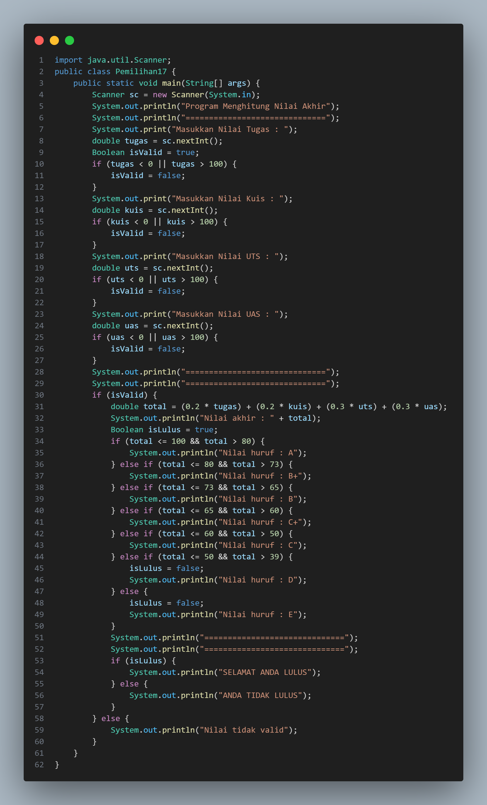

 Dan Ini adalah Output yang benar

 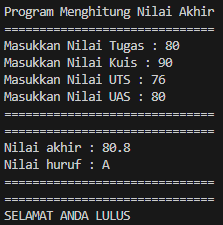

 Dan ini adalah hasil Output yang salah

 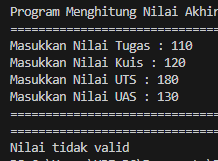

 

<b>Perulangan</b>

Ini adalah kode program dari Perulangan

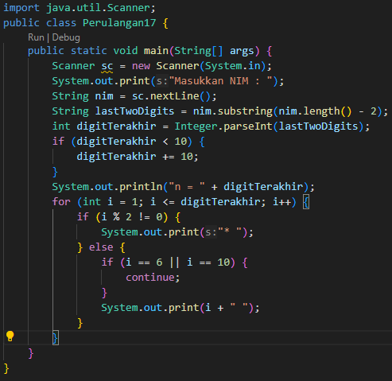

Dan Ini adalah Outputnya

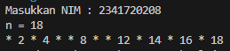

 

<b>Array</b>

Ini adalah kode program dari Array

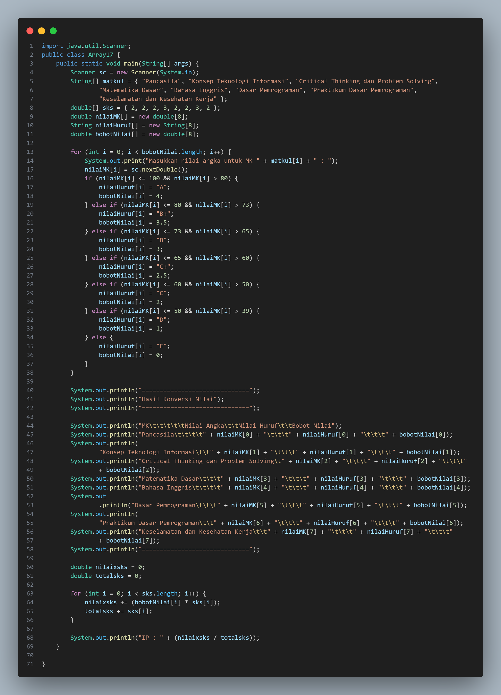

Dan ini adalah Outputnya

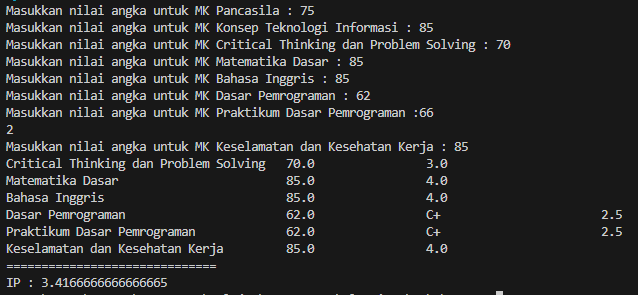

 

<b>Fungsi</b>

Ini adalah kode program dari Fungsi

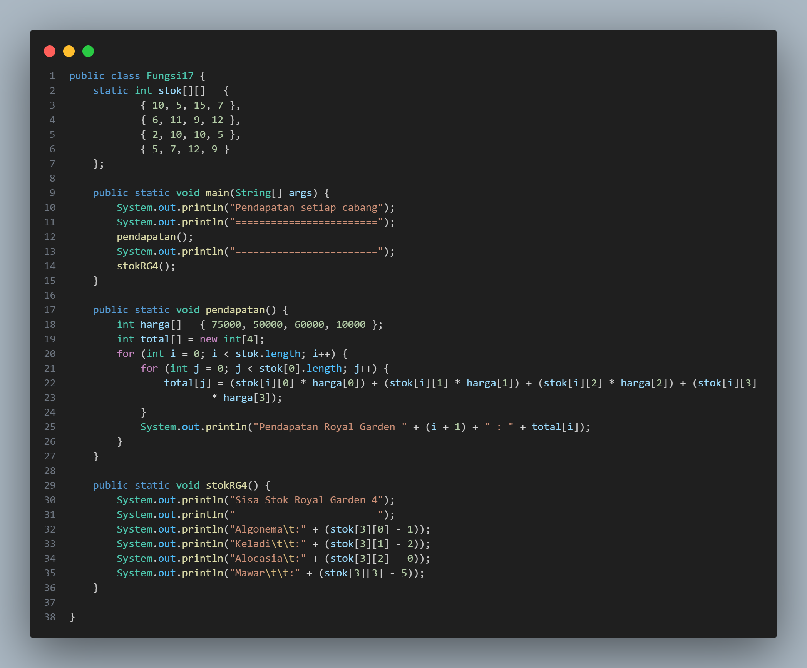

Dan ini adalah hasil Outputnya

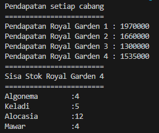

 

<b>Tugas</b>
1. Mengeluarkan nama kota plat nomer

Ini adalah kode program dari Tugas 1

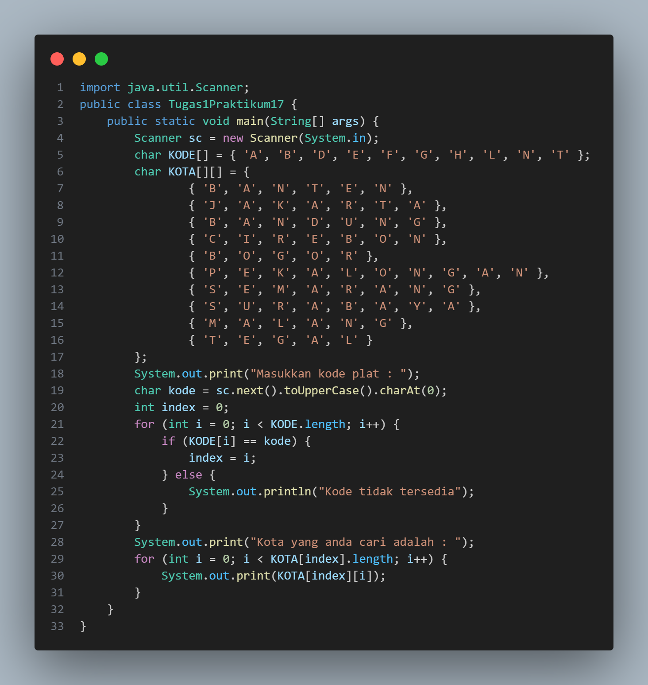

Dan ini adalah hasil Outputnya

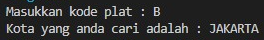

 

2. Membuat Program Hitung Jarak, Kecepatan, Waktu

Ini adalah Kode Program dari Tugas 2

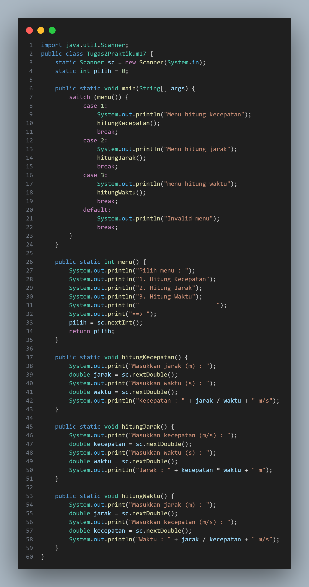

Ini adalah Output Kecepatan

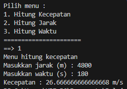

Ini adalah Output Jarak

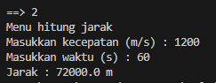

Ini adalah Output Waktu

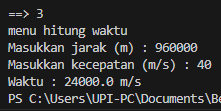
