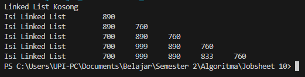
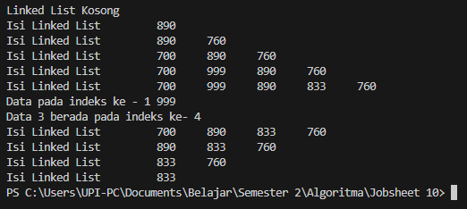
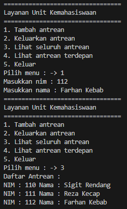
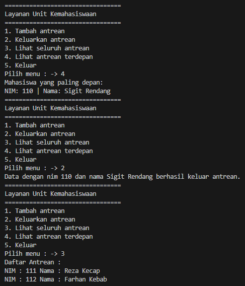
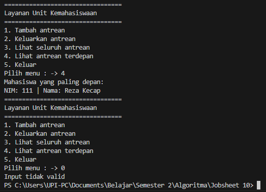

# 
  LAPORAN PRAKTIKUM IX ALGORITMA DAN STRUKTUR DATA 
 
  

    

 

 Nama  : Luthfi Triaswangga 

 NIM   : 2341720208 

 Prodi : TEKNIK INFOMATIKA

 Kelas : 1B 

 

<b>Praktikum 1 : Single Linked List</b> 
Kode Program Class Node 
    package Praktikum1;

    public class Node17 {
    int data;
    Node17 next;

    Node17() {

    }

    Node17(int nilai, Node17 berikutnya) {
        data = nilai;
        next = berikutnya;
    }
    }

 Kode Program SingleLinkedList

    package Praktikum1;

    public class SingleLinkedList17 {
    Node17 head, tail;

    boolean isEmpty() {
        return head == null;
    }

    void print() {
        if (!isEmpty()) {
            Node17 tmp = head;
            System.out.print("Isi Linked List \t");
            while (tmp != null) {
                System.out.print(tmp.data + "\t");
                tmp = tmp.next;

            }
            System.out.println("");
        } else {
            System.out.println("Linked List Kosong");
        }
    }

    void addFirst(int input) {
        Node17 ndInput = new Node17(input, null);
        if (isEmpty()) {
            head = ndInput;
            tail = ndInput;
        } else {
            ndInput.next = head;
            head = ndInput;
        }
    }

    void addLast(int input) {
        Node17 ndInput = new Node17(input, null);
        ndInput.data = input;
        if (!isEmpty()) {
            tail.next = ndInput;
            tail = ndInput;
        } else {
            head = ndInput;
            tail = ndInput;
        }
    }

    void insertAfter(int key, int input) {
        Node17 ndInput = new Node17(input, null);
        Node17 temp = head;
        do {
            if (temp.data == key) {
                ndInput.next = temp.next;
                temp.next = ndInput;
                if (ndInput.next == null) {
                    tail = ndInput;
                    break;
                }
            }
            temp = temp.next;
        } while (temp != null);
    }

    void insertAt(int index, int input) {
        Node17 ndInput = new Node17(input, null);
        if (index == -1) {
            addFirst(input);
        } else {
            Node17 temp = head;
            for (int i = 0; i < index-1; i++) {
                temp = temp.next;
            }
            temp.next = new Node17(input, temp.next);
            if (temp.next.next == null) {
                tail = temp.next;
            }
        }
    }
    }

 Kode Program Class Main

    package Praktikum1;

    public class SLLMain {
    public static void main(String[] args) {
        SingleLinkedList17 singLL = new SingleLinkedList17();
        singLL.print();
        singLL.addFirst(890);
        singLL.print();
        singLL.addLast(760);
        singLL.print();
        singLL.addFirst(700);
        singLL.print();
        singLL.insertAfter(700, 999);
        singLL.print();
        singLL.insertAt(3, 833);
        singLL.print();
    }
    }

  Output Kode Program 
 

<b>Pertanyaan 1 : Single Linked List </b>

1. Mengapa hasil compile kode program di baris pertama menghasilkan “Linked List Kosong”? <b>
Karena belum ada data yang masuk (dilihat dari pengecekan head, dan head bernilai kosong), sehingga data linked list masih kosong dan mencetak peringatan "Linked List Kosong"</b> 
2. Jelaskan kegunaan variable temp secara umum pada setiap method! <b>
Variabel temp digunakan instansiasi ke kelas node atau referensi ke node saat sedang melakukan operasi pada linked list. Variabel ini digunakan untuk melacak posisi saat melakukan iterasi melalui linked list atau saat mencari node tertentu.</b> 
3. Perhatikan class SingleLinkedList, pada method insertAt Jelaskan kegunaan kode berikut 
`if (temp.next.next == null) { tail = temp.next; }` 
<b>Kode ini digunakan untuk memeriksa apakah node yang baru dimasukkan akan menjadi node terakhir dalam linked list setelah penambahan elemen. Jika iya, artinya node baru tersebut akan menjadi tail dari linked list.</b> 

<b>Praktikum 2</b> 
Update Kode Program SingleLinkedList 

    package Praktikum1;

    public class SingleLinkedList17 {
    Node17 head, tail;

    boolean isEmpty() {
        return head == null;
    }

    void print() {
        if (!isEmpty()) {
            Node17 tmp = head;
            System.out.print("Isi Linked List \t");
            while (tmp != null) {
                System.out.print(tmp.data + "\t");
                tmp = tmp.next;

            }
            System.out.println("");
        } else {
            System.out.println("Linked List Kosong");
        }
    }

    void addFirst(int input) {
        Node17 ndInput = new Node17(input, null);
        if (isEmpty()) {
            head = ndInput;
            tail = ndInput;
        } else {
            ndInput.next = head;
            head = ndInput;
        }
    }

    void addLast(int input) {
        Node17 ndInput = new Node17();
        ndInput.data = input;
        if (!isEmpty()) {
            tail.next = ndInput;
            tail = ndInput;
        } else {
            head = ndInput;
            tail = ndInput;
        }
    }

    void insertAfter(int key, int input) {
        Node17 ndInput = new Node17(input, null);
        Node17 temp = head;
        do {
            if (temp.data == key) {
                ndInput.next = temp.next;
                temp.next = ndInput;
                if (ndInput.next == null) {
                    tail = ndInput;
                    break;
                }
            }
            temp = temp.next;
        } while (temp != null);
    }

    void insertAt(int index, int input) {
        Node17 ndInput = new Node17();
        if (index == -1) {
            addFirst(input);
        } else {
            Node17 temp = head;
            for (int i = 0; i < index - 1; i++) {
                temp = temp.next;
            }
            temp.next = new Node17(input, temp.next);
            if (temp.next.next == null) {
                tail = temp.next;
            }
        }
    }

    int getData(int index) {
        Node17 tmp = head;
        for (int i = 0; i < index - 1; i++) {
            tmp = tmp.next;
        }
        return tmp.next.data;
    }

    int indexOf(int key) {
        Node17 tmp = head;
        int index = 0;
        while (tmp != null && tmp.data != key) {
            tmp = tmp.next;
            index++;
        }
        if (tmp == null) {
            return -1;
        } else {
            return index;
        }
    }

    void removeFirst() {
        if (isEmpty()) {
            System.out.println("Linked list masih kosong, tidak dapat dihapus");
        } else if (head == tail) {
            head = tail = null;
        } else {
            head = head.next;
        }
    }

    void removeLast() {
        if (isEmpty()) {
            System.out.println("Linked list masih kosong, tidak dapat dihapus");
        } else if (head == tail) {
            head = tail = null;
        } else {
            Node17 temp = head;
            while (temp.next == null) {
                temp = temp.next;
            }
            temp.next = null;
            tail = temp.next;
        }
    }

    void remove(int key) {
        if (isEmpty()) {
            System.out.println("Linked List masih kosong, tidak dapat dihapus");
        } else {
            Node17 temp = head;
            while (temp != null) {
                if (temp.data == key && temp == head) {
                    removeFirst();
                    break;
                } else if (temp.next.data == key) {
                    temp.next = temp.next.next;
                    if (temp.next == null) {
                        tail = temp;
                    }
                    break;
                }
                temp = temp.next;
            }
        }
    }

    public void removeAt(int index) {
        if (index == 0) {
            removeFirst();
        } else {
            Node17 temp = head;
            for (int i = 0; i < index; i++) {
                temp = temp.next;
            }
            temp.next = temp.next.next;
            if (temp.next == null) {
                tail = temp;
            }
        }
    }
    }

 Update Kode Main 

    package Praktikum1;

    public class SLLMain {
    public static void main(String[] args) {
        SingleLinkedList17 singLL = new SingleLinkedList17();
        singLL.print();
        singLL.addFirst(890);
        singLL.print();
        singLL.addLast(760);
        singLL.print();
        singLL.addFirst(700);
        singLL.print();
        singLL.insertAfter(700, 999);
        singLL.print();
        singLL.insertAt(3, 833);
        singLL.print();

        System.out.println("Data pada indeks ke - 1 " + singLL.getData(1));
        System.out.println("Data 3 berada pada indeks ke- " + singLL.indexOf(760));

        singLL.remove(999);
        singLL.print();
        singLL.removeAt(0);
        singLL.print();
        singLL.removeFirst();
        singLL.print();
        singLL.removeLast();
        singLL.print();
    }
    }

 Update Output Kode Program 

Pertanyaan 2  

1. Mengapa digunakan keyword break pada fungsi remove? Jelaskan! <b>
Untuk keluar dari perulangan while setelah menemukan nilai yang ditemukan untuk kemudian dihapus.<brr></b>
2. Jelaskan kegunaan kode dibawah pada method remove 
`else if (temp.next.data == key) {` 
`temp.next = temp.next.next;` 
<b>Digunakan untuk menghapus node yang memiliki nilai data yang sama dengan nilai key yang dicari yang kemudian digantikan dengan nilai selanjutnya. </b>

<b>Tugas 1</b> 

1. Implementasikan ilustrasi Linked List Berikut. Gunakan 4 macam penambahan data yang telah
dipelajari sebelumnya untuk menginputkan data. 

Kode program : Mahasiswa17, MahasiswaLinkedListed, Main 

Output Kode Program : 

2. Buatlah implementasi program antrian layanan unit kemahasiswaan sesuai dengan kondisi yang
ditunjukkan pada soal nomor 1! Ketentuan 
a. Implementasi antrian menggunakan Queue berbasis Linked List! 
b. Program merupakan proyek baru, bukan modifikasi dari soal nomor 1! 

Kode Program : MahasiswaQueue, QueueMain 

Output Kode Program : 

 
 
 