# 
  LAPORAN PRAKTIKUM IX ALGORITMA DAN STRUKTUR DATA 
 
  

    

 

 Nama  : Luthfi Triaswangga 

 NIM   : 2341720208 

 Prodi : TEKNIK INFOMATIKA

 Kelas : 1B 

 

<b>Praktikum 1 : Double Linked List :  </b>
Kode Program class Node 

    package DoubleLinkedList;

    public class Node{
    int data;
    Node prev, next;

    Node(Node prev, int data, Node next){
        this.prev=prev;
        this.data=data;
        this.next=next;
    }
    }

  Kode Program DoubleLinkedList :  

    package DoubleLinkedList;

    public class DoubleLinkedLists {
    Node head;
    int size;

    public DoubleLinkedLists() {
        head = null;
        size = 0;
    }
    public boolean isEmpty() {
        return head == null;
    }
    public void addFirst(int item) {
        if (isEmpty()) {
            head = new Node(null, item, null);
        } else {
            Node newNode = new Node(null, item, head);
            head.prev = newNode;
            head = newNode;
        }
        size++;
    }
    public void removeFirst() throws Exception {
        if (isEmpty()) {
            throw new Exception("Linked List Masih Kosong, tidak dapat dihapus!");
        } else if (size == 1) {
            head = null;
        } else {
            head = head.next;
            head.prev = null;
        }
        size--;
    }
    public int getFirst() throws Exception {
        if (isEmpty()) {
            throw new Exception("Linked List Kosong");
        }
        return head.data;
    }
    public void addLast(int item) {
        if (isEmpty()) {
            addFirst(item);
        } else {
            Node current = head;
            while (current.next != null) {
                current = current.next;
            }
            Node newNode = new Node(current, item, null);
            current.next = newNode;
            size++;
        }
    }
    public void removeLast() throws Exception {
        if (isEmpty()) {
            throw new Exception("Linked List Masih Kosong, tidak dapat dihapus!");
        } else if (size == 1) {
            head = null;
        } else {
            Node current = head;
            while (current.next.next != null) {
                current = current.next;
            }
            current.next = null;
        }
        size--;
    }
    public int getLast() throws Exception {
        if (isEmpty()) {
            throw new Exception("Linked List Kosong");
        }
        Node tmp = head;
        while (tmp.next != null) {
            tmp = tmp.next;
        }
        return tmp.data;
    }
    public void add(int item, int index) throws Exception {
        if (index < 0 || index > size) {
            throw new Exception("Nilai indeks diluar batas");
        } else if (index == 0) {
            addFirst(item);
        } else if (index == size) {
            addLast(item);
        } else {
            Node current = head;
            int i = 0;
            while (i < index) {
                current = current.next;
                i++;
            }
            Node newNode = new Node(current.prev, item, current);
            current.prev.next = newNode;
            current.prev = newNode;
            size++;
        }
    }
    public void remove(int index) throws Exception {
        if (isEmpty() || index >= size || index < 0) {
            throw new Exception("Nilai Indeks Di Luar Batas");
        } else if (index == 0) {
            removeFirst();
        } else {
            Node current = head;
            int i = 0;
            while (i < index) {
                current = current.next;
                i++;
            }
            if (current.next == null) {
                current.prev.next = null;
            } else if (current.prev == null) {
                head = current.next;
                head.prev = null;
            } else {
                current.prev.next = current.next;
                current.next.prev = current.prev;
            }
            size--;
        }
    }
    public int get(int index) throws Exception {
        if (isEmpty() || index < 0 || index >= size) {
            throw new Exception("Nilai Indeks Diluar Batas");
        }
        Node tmp = head;
        for (int i = 0; i < index; i++) {
            tmp = tmp.next;
        }
        return tmp.data;
    }
    public int size() {
        return size;
    }
    public void clear() {
        head = null;
        size = 0;
    }
    public void print() {
        if (!isEmpty()) {
            Node tmp = head;
            while (tmp != null) {
                System.out.print(tmp.data + "\t");
                tmp = tmp.next;
            }
            System.out.println("\nBerhasil Di Isi");
        } else {
            System.out.println("Linked Lists Kosong");
        }
    }
    }

 Kode Program DoubleMain :  
    package DoubleLinkedList;

    public class DoubleMain {
    public static void main(String[] args) {
        DoubleLinkedLists dll = new DoubleLinkedLists();
        dll.print();
        System.out.println("Size : " + dll.size());
        System.out.println("==================================");
        dll.addFirst(3);
        dll.addLast(4);
        dll.addFirst(7);
        dll.print();
        System.out.println("Size " + dll.size());
        System.out.println("=====================================");
        try {
            dll.add(40, 1);
        } catch (Exception e) {
            System.out.println(e.getMessage());
        }
        dll.print();
        System.out.println("Size : " + dll.size());
        System.out.println("=====================================");
        try {
            System.out.println("Data Awal Pada Linked Lists Adalah : " + dll.getFirst());
        } catch (Exception e) {
            System.out.println(e.getMessage());
        }
        try {
            System.out.println("Data Akhir Pada Linked Lists Adalah : " + dll.getLast());
        } catch (Exception e) {
            System.out.println(e.getMessage());
        }
        try {
            System.out.println("Data Indeks Ke-1 Pada Linked Lists Adalah : " + dll.get(1));
        } catch (Exception e) {
            System.out.println(e.getMessage());
        }
        dll.clear();
        dll.print();
        System.out.println("Size : " + dll.size());
        System.out.println("=====================================");
        dll.addLast(50);
        dll.addLast(40);
        dll.addLast(10);
        dll.addLast(20);
        dll.print();
        System.out.println("Size : " + dll.size());
        System.out.println("=====================================");
        try {
            dll.removeFirst();
        } catch (Exception e) {
            System.out.println(e.getMessage());
        }
        dll.print();
        System.out.println("Size : " + dll.size());
        System.out.println("=====================================");
        try {
            dll.removeLast();
        } catch (Exception e) {
            System.out.println(e.getMessage());
        }
        dll.print();
        System.out.println("Size : " + dll.size());
        System.out.println("=====================================");
        try {
            dll.remove(1);
        } catch (Exception e) {
            System.out.println(e.getMessage());
        }
        dll.print();
        System.out.println("Size : " + dll.size());
    }
    }

 Output Kode Program 
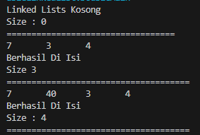 

<b>Pertanyaan 1 : Double Linked List</b>

1. Jelaskan perbedaan antara single linked list dengan double linked lists! 
<b>Single Linked List (SLL) dan Double Linked List (DLL) adalah dua<</b>

2. Perhatikan class Node, di dalamnya terdapat atribut next dan prev. Untuk apakah atribut
tersebut? 
<b>Atribut next dan prev digunakan untuk menghubungkan node-node dalam linked list.</b>

3. Perhatikan konstruktor pada class DoubleLinkedLists. Apa kegunaan inisialisasi atribut head dan
size seperti pada gambar berikut ini? 
`public DoubleLinkedLists() {
        head = null;
        size = 0;
    }`  
<b>Konstruktor DoubleLinkedLists pada kode tersebut digunakan untuk menginisialisasi objek dari kelas DoubleLinkedLists. Inisialisasi atribut head adalah referensi yang menunjuk ke node pertama dalam daftar berantai ganda (double-linked list). sedangkan Inisialisasi size untuk menyimpan informasi tentang jumlah elemen (node) yang ada dalam daftar berantai ganda.</b>

4. Pada method addFirst(), kenapa dalam pembuatan object dari konstruktor class Node prev
dianggap sama dengan null? 
`Node newNode = new Node(null, item, head);`  
<b>Dalam metode addFirst(), pembuatan objek dari konstruktor class Node dengan prev dianggap sama dengan null memiliki alasan yang jelas terkait dengan bagaimana daftar berantai ganda (double-linked list) bekerja ketika menambahkan node baru di awal daftar.</b>

5. Perhatikan pada method addFirst(). Apakah arti statement head.prev = newNode ? 
<b>Dalam konteks metode addFirst(), pernyataan head.prev = newNode memiliki arti dan fungsi yang penting dalam mengelola struktur dari double-linked list</b>

6. Perhatikan isi method addLast(), apa arti dari pembuatan object Node dengan mengisikan
parameter prev dengan current, dan next dengan null?
Node newNode = new Node(current, item, null); 
<b>Artinya adalah membuat node baru dengan prev menyimpan alamat node terakhir dan next yang bernilai null karena node terakhir tidak memiliki next.</b>

7. Pada method add(), terdapat potongan kode program sebagai berikut: 
jelaskan maksud dari bagian yang ditandai dengan kotak kuning 
<b>Maksudnya adalah jika yang ditemukan adalah node dengan node prev yang bernilai null (node paling awal), maka akan dibuat node baru yang akan menjadi node paling awal.

Praktikum 2</b> 
Kode Program DoubleLinkedList :  

    package DoubleLinkedList;

    public class DoubleLinkedLists {
    Node head;
    int size;

        public DoubleLinkedLists() {
            head = null;
            size = 0;
        }
    public boolean isEmpty() {
        return head == null;
    }
    public void addFirst(int item) {
        if (isEmpty()) {
            head = new Node(null, item, null);
        } else {
            Node newNode = new Node(null, item, head);
            head.prev = newNode;
            head = newNode;
        }
        size++;
    }
    public void removeFirst() throws Exception {
        if (isEmpty()) {
            throw new Exception("Linked List Masih Kosong, tidak dapat dihapus!");
        } else if (size == 1) {
            head = null;
        } else {
            head = head.next;
            head.prev = null;
        }
        size--;
    }
    public int getFirst() throws Exception {
        if (isEmpty()) {
            throw new Exception("Linked List Kosong");
        }
        return head.data;
    }
    public void addLast(int item) {
        if (isEmpty()) {
            addFirst(item);
        } else {
            Node current = head;
            while (current.next != null) {
                current = current.next;
            }
            Node newNode = new Node(current, item, null);
            current.next = newNode;
            size++;
        }
    }
    public void removeLast() throws Exception {
        if (isEmpty()) {
            throw new Exception("Linked List Masih Kosong, tidak dapat dihapus!");
        } else if (size == 1) {
            head = null;
        } else {
            Node current = head;
            while (current.next.next != null) {
                current = current.next;
            }
            current.next = null;
        }
        size--;
    }
    public int getLast() throws Exception {
        if (isEmpty()) {
            throw new Exception("Linked List Kosong");
        }
        Node tmp = head;
        while (tmp.next != null) {
            tmp = tmp.next;
        }
        return tmp.data;
    }
    public void add(int item, int index) throws Exception {
        if (index < 0 || index > size) {
            throw new Exception("Nilai indeks diluar batas");
        } else if (index == 0) {
            addFirst(item);
        } else if (index == size) {
            addLast(item);
        } else {
            Node current = head;
            int i = 0;
            while (i < index) {
                current = current.next;
                i++;
            }
            Node newNode = new Node(current.prev, item, current);
            current.prev.next = newNode;
            current.prev = newNode;
            size++;
        }
    }
    public void remove(int index) throws Exception {
        if (isEmpty() || index >= size || index < 0) {
            throw new Exception("Nilai Indeks Di Luar Batas");
        } else if (index == 0) {
            removeFirst();
        } else {
            Node current = head;
            int i = 0;
            while (i < index) {
                current = current.next;
                i++;
            }
            if (current.next == null) {
                current.prev.next = null;
            } else if (current.prev == null) {
                head = current.next;
                head.prev = null;
            } else {
                current.prev.next = current.next;
                current.next.prev = current.prev;
            }
            size--;
        }
    }
    public int get(int index) throws Exception {
        if (isEmpty() || index < 0 || index >= size) {
            throw new Exception("Nilai Indeks Diluar Batas");
        }
        Node tmp = head;
        for (int i = 0; i < index; i++) {
            tmp = tmp.next;
        }
        return tmp.data;
    }
    public int size() {
        return size;
    }
    public void clear() {
        head = null;
        size = 0;
    }
    public void print() {
        if (!isEmpty()) {
            Node tmp = head;
            while (tmp != null) {
                System.out.print(tmp.data + "\t");
                tmp = tmp.next;
            }
            System.out.println("\nBerhasil Di Isi");
        } else {
            System.out.println("Linked Lists Kosong");
        }
    }
    }

  Kode Program DoubleMain :  

    package DoubleLinkedList;

    public class DoubleMain {
    public static void main(String[] args) {
        DoubleLinkedLists dll = new DoubleLinkedLists();
        dll.print();
        System.out.println("Size : " + dll.size());
        System.out.println("==================================");
        dll.addFirst(3);
        dll.addLast(4);
        dll.addFirst(7);
        dll.print();
        System.out.println("Size " + dll.size());
        System.out.println("=====================================");
        try {
            dll.add(40, 1);
        } catch (Exception e) {
            System.out.println(e.getMessage());
        }
        dll.print();
        System.out.println("Size : " + dll.size());
        System.out.println("=====================================");
        try {
            System.out.println("Data Awal Pada Linked Lists Adalah : " + dll.getFirst());
        } catch (Exception e) {
            System.out.println(e.getMessage());
        }
        try {
            System.out.println("Data Akhir Pada Linked Lists Adalah : " + dll.getLast());
        } catch (Exception e) {
            System.out.println(e.getMessage());
        }
        try {
            System.out.println("Data Indeks Ke-1 Pada Linked Lists Adalah : " + dll.get(1));
        } catch (Exception e) {
            System.out.println(e.getMessage());
        }
        dll.clear();
        dll.print();
        System.out.println("Size : " + dll.size());
        System.out.println("=====================================");
        dll.addLast(50);
        dll.addLast(40);
        dll.addLast(10);
        dll.addLast(20);
        dll.print();
        System.out.println("Size : " + dll.size());
        System.out.println("=====================================");
        try {
            dll.removeFirst();
        } catch (Exception e) {
            System.out.println(e.getMessage());
        }
        dll.print();
        System.out.println("Size : " + dll.size());
        System.out.println("=====================================");
        try {
            dll.removeLast();
        } catch (Exception e) {
            System.out.println(e.getMessage());
        }
        dll.print();
        System.out.println("Size : " + dll.size());
        System.out.println("=====================================");
        try {
            dll.remove(1);
        } catch (Exception e) {
            System.out.println(e.getMessage());
        }
        dll.print();
        System.out.println("Size : " + dll.size());
    }
    }

  Output Kode Program 

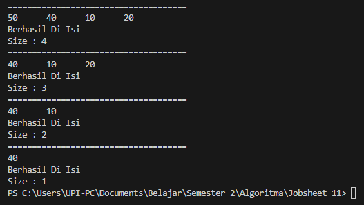 

Pertanyaan 2 

1. Apakah maksud statement berikut pada method removeFirst()?
head = head.next;
head.prev = null;  
<b>Maksudnya adalah menggeser alamat head ke node setelahnya dan menjadikan node prev dari node tersebut menjadi null</b>

2. Bagaimana cara mendeteksi posisi data ada pada bagian akhir pada method removeLast()? 
<b>Dengan melakukan while loop sampai menemukan node sebelum node terakhir. Kemudian menghapus node next dari node tersebut</b>

3. Jelaskan alasan potongan kode program di bawah ini tidak cocok untuk perintah remove! <b>
Alasannya adalah potongan tersebut hanya bisa menghapus node next dari node head. Sedangkan perintah remove dibutuhkan untuk bisa menghapus node di index manapun.</b>

4. Jelaskan fungsi kode program berikut ini pada fungsi remove! <b>
Fungsinya adalah untuk mengubah alamat referensi dari node next dari node sebelum node yang ingin dihapus menjadi node setelah node yang ingin dihapus dan mengubah alamat referensi dari node prev dari node setelah node yang ingin dihapus menjadi node sebelum node yang ingin dihapus</b>

<b> Praktikum 3</b> 

Kode Program DoubleLinkedList :  

    package DoubleLinkedList;

    public class DoubleLinkedLists {
    Node head;
    int size;

        public DoubleLinkedLists() {
            head = null;
            size = 0;
        }
    public boolean isEmpty() {
        return head == null;
    }
    public void addFirst(int item) {
        if (isEmpty()) {
            head = new Node(null, item, null);
        } else {
            Node newNode = new Node(null, item, head);
            head.prev = newNode;
            head = newNode;
        }
        size++;
    }
    public void removeFirst() throws Exception {
        if (isEmpty()) {
            throw new Exception("Linked List Masih Kosong, tidak dapat dihapus!");
        } else if (size == 1) {
            head = null;
        } else {
            head = head.next;
            head.prev = null;
        }
        size--;
    }
    public int getFirst() throws Exception {
        if (isEmpty()) {
            throw new Exception("Linked List Kosong");
        }
        return head.data;
    }
    public void addLast(int item) {
        if (isEmpty()) {
            addFirst(item);
        } else {
            Node current = head;
            while (current.next != null) {
                current = current.next;
            }
            Node newNode = new Node(current, item, null);
            current.next = newNode;
            size++;
        }
    }
    public void removeLast() throws Exception {
        if (isEmpty()) {
            throw new Exception("Linked List Masih Kosong, tidak dapat dihapus!");
        } else if (size == 1) {
            head = null;
        } else {
            Node current = head;
            while (current.next.next != null) {
                current = current.next;
            }
            current.next = null;
        }
        size--;
    }
    public int getLast() throws Exception {
        if (isEmpty()) {
            throw new Exception("Linked List Kosong");
        }
        Node tmp = head;
        while (tmp.next != null) {
            tmp = tmp.next;
        }
        return tmp.data;
    }
    public void add(int item, int index) throws Exception {
        if (index < 0 || index > size) {
            throw new Exception("Nilai indeks diluar batas");
        } else if (index == 0) {
            addFirst(item);
        } else if (index == size) {
            addLast(item);
        } else {
            Node current = head;
            int i = 0;
            while (i < index) {
                current = current.next;
                i++;
            }
            Node newNode = new Node(current.prev, item, current);
            current.prev.next = newNode;
            current.prev = newNode;
            size++;
        }
    }
    public void remove(int index) throws Exception {
        if (isEmpty() || index >= size || index < 0) {
            throw new Exception("Nilai Indeks Di Luar Batas");
        } else if (index == 0) {
            removeFirst();
        } else {
            Node current = head;
            int i = 0;
            while (i < index) {
                current = current.next;
                i++;
            }
            if (current.next == null) {
                current.prev.next = null;
            } else if (current.prev == null) {
                head = current.next;
                head.prev = null;
            } else {
                current.prev.next = current.next;
                current.next.prev = current.prev;
            }
            size--;
        }
    }
    public int get(int index) throws Exception {
        if (isEmpty() || index < 0 || index >= size) {
            throw new Exception("Nilai Indeks Diluar Batas");
        }
        Node tmp = head;
        for (int i = 0; i < index; i++) {
            tmp = tmp.next;
        }
        return tmp.data;
    }
    public int size() {
        return size;
    }
    public void clear() {
        head = null;
        size = 0;
    }
    public void print() {
        if (!isEmpty()) {
            Node tmp = head;
            while (tmp != null) {
                System.out.print(tmp.data + "\t");
                tmp = tmp.next;
            }
            System.out.println("\nBerhasil Di Isi");
        } else {
            System.out.println("Linked Lists Kosong");
        }
    }
    }

 Kode Program DoubleMain :  

    package DoubleLinkedList;

    public class DoubleMain {
    public static void main(String[] args) {
        DoubleLinkedLists dll = new DoubleLinkedLists();
        dll.print();
        System.out.println("Size : " + dll.size());
        System.out.println("==================================");
        dll.addFirst(3);
        dll.addLast(4);
        dll.addFirst(7);
        dll.print();
        System.out.println("Size " + dll.size());
        System.out.println("=====================================");
        try {
            dll.add(40, 1);
        } catch (Exception e) {
            System.out.println(e.getMessage());
        }
        dll.print();
        System.out.println("Size : " + dll.size());
        System.out.println("=====================================");
        try {
            System.out.println("Data Awal Pada Linked Lists Adalah : " + dll.getFirst());
        } catch (Exception e) {
            System.out.println(e.getMessage());
        }
        try {
            System.out.println("Data Akhir Pada Linked Lists Adalah : " + dll.getLast());
        } catch (Exception e) {
            System.out.println(e.getMessage());
        }
        try {
            System.out.println("Data Indeks Ke-1 Pada Linked Lists Adalah : " + dll.get(1));
        } catch (Exception e) {
            System.out.println(e.getMessage());
        }
        dll.clear();
        dll.print();
        System.out.println("Size : " + dll.size());
        System.out.println("=====================================");
        dll.addLast(50);
        dll.addLast(40);
        dll.addLast(10);
        dll.addLast(20);
        dll.print();
        System.out.println("Size : " + dll.size());
        System.out.println("=====================================");
        try {
            dll.removeFirst();
        } catch (Exception e) {
            System.out.println(e.getMessage());
        }
        dll.print();
        System.out.println("Size : " + dll.size());
        System.out.println("=====================================");
        try {
            dll.removeLast();
        } catch (Exception e) {
            System.out.println(e.getMessage());
        }
        dll.print();
        System.out.println("Size : " + dll.size());
        System.out.println("=====================================");
        try {
            dll.remove(1);
        } catch (Exception e) {
            System.out.println(e.getMessage());
        }
        dll.print();
        System.out.println("Size : " + dll.size());
    }
    }

 Output Kode Program :  

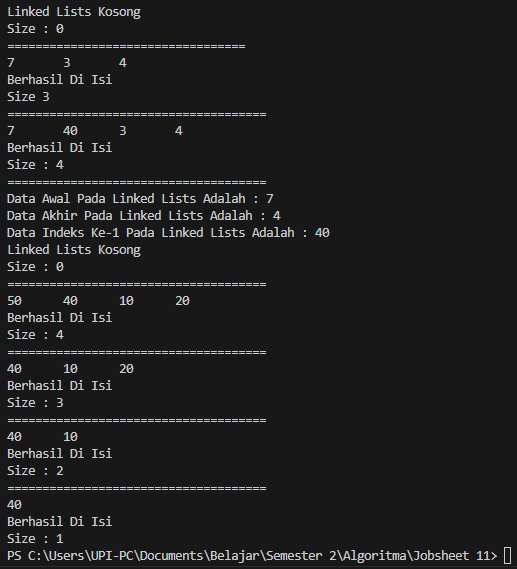 

Pertanyaan 3  

1. Jelaskan method size() pada class DoubleLinkedLists! <b>
Method tersebut mengembalikan integer size atau jumlah node yang ada di dalam Double Linked List</b>
2. Jelaskan cara mengatur indeks pada double linked lists supaya dapat dimulai dari indeks ke1! <b>
Caranya adalah dengan mengubah seluruh variable i yang digunakan untuk perulangan menjadi 1.</b>
3. Jelaskan perbedaan karakteristik fungsi Add pada Double Linked Lists dan Single Linked Lists! <b>Perbedaanya adalah Single Linked List menambahkan node baru pada setelah node yang didapat dari pencarian index, sedangkan Double Linked List menambahkan node baru sebelum node yang didapat dari pencarian index.</b>
4. Jelaskan perbedaan logika dari kedua kode program di bawah ini! <b>
Perbedaannya adalah kode a memeriksa variable size untuk mendapatkan kembalian boolean, sedangkan kode b menggunakan variable head untuk mendapatkan kembalian boolean</b>

<b>Tugas 1 : Studi Kasus Vaksin</b> 

Kode Program NodeV :  

    package Tugas;

    public class NodeV {
    int nomor;
    String nama;
    NodeV prev, next;

    NodeV(NodeV prev, int nomor, String nama, NodeV next) {
        this.nomor = nomor;
        this.nama = nama;
        this.prev = prev;
        this.next = next;
    }
}

<vr>Kode Program VaksinDLL :  

    package Tugas;

    ublic class VaksinDLL17 {
    NodeV head;
    int size;

    public VaksinDLL17() {
        head = null;
        size = 0;
    }

    public boolean isEmpty() {
        return head == null;
    }

    public int size() {
        return size;
    }

    public void clear() {
        head = null;
        size = 0;
    }

    public void print() {
        if (!isEmpty()) {
            NodeV current = head;

            System.out.printf("| %-5s | %-10s |\n", "No.", "Nama");

            while (current != null) {
                System.out.printf("| %-5d | %-10s |\n", current.nomor, current.nama);
                current = current.next;
            }
            System.out.println("Sisa antrian : " + size());
        } else {
            System.out.println("Antrian Kosong!");
        }
    }

    public void enQueue(int nomor, String nama) {
        if (isEmpty()) {
            head = new NodeV(null, nomor, nama, null);
        } else {
            NodeV newNode = new NodeV(null, nomor, nama, head);
            head.prev = newNode;
            head = newNode;
        }

        size++;
    }

    public NodeV deQueue() throws Exception {
        NodeV temp = head;

        if (isEmpty()) {
            throw new Exception("Antrian masih kosong, tidak dapat melayani!");
        } else if (size == 1) {
            head = null;
            size--;
        } else {
            head = head.next;
            head.prev = null;
            size--;
        }

        return temp;
    }
}

 Kode Program VaksinMain 

    package Tugas;

    import java.util.Scanner;

    public class VaksinMain {

    public static void main(String[] args) {

        Scanner sc = new Scanner(System.in);
        VaksinDLL17 DLLVaksin = new VaksinDLL17();
        int pilihan = -1;

        do {
            System.out.println("-----------------------------");
            System.out.println("PENGANTRI VAKSIN AFIFAHAPOTEK");
            System.out.println("-----------------------------");
            System.out.println("[1] Tambah ke antrian");
            System.out.println("[2] Layani pengantri vaksin");
            System.out.println("[3] Daftar penerima vaksin");
            System.out.println("[4] Keluar");
            System.out.println("-----------------------------");
            System.out.print("> Pilih menu : ");
            pilihan = sc.nextInt();
            sc.nextLine();

            switch (pilihan) {
                case 1:
                    System.out.println("-----------------------------");
                    System.out.println("Masukkan Data Penerima Vaksin");
                    System.out.println("-----------------------------");
                    System.out.print("> Nomor antrian : ");
                    int nomor = sc.nextInt();
                    sc.nextLine();
                    System.out.print("> Nama penerima : ");
                    String nama = sc.nextLine();
                    DLLVaksin.enQueue(nomor, nama);
                    break;

                case 2:
                    try {

                        System.out.println("-----------------------------");
                        System.out.println(DLLVaksin.deQueue().nama + " telah selesai divaksinasi.");
                        System.out.println("-----------------------------");
                    } catch (Exception e) {
                        e.printStackTrace();
                    }
                    break;

                case 3:
                    System.out.println("-----------------------");
                    System.out.println("Daftar Pengantri Vaksin");
                    System.out.println("-----------------------");
                    DLLVaksin.print();
                    break;

                case 4:
                    System.out.println("Goodbye :)");
                    break;

                default:
                    System.out.println("Pilihan tidak tersedia!");
                    break;
            }

        } while (pilihan != 4);

        sc.close();
    }
    }

 Output Kode Program :  
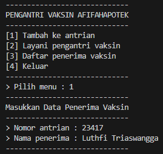 
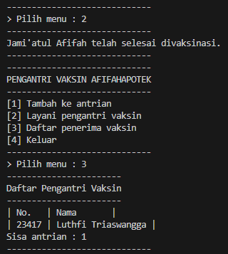 

<b>Tugas 2 : Studi Kasus Film</b> 

Kode Program NodeF :  

    package Tugas;

    public class NodeF {
    NodeF prev, next;
    int id;
    String judul;
    double rating;

    NodeF(NodeF prev, int id, String judul, double rating, NodeF next) {
        this.prev = prev;
        this.id = id;
        this.judul = judul;
        this.rating = rating;
        this.next = next;
    }
    }

 Kode Program FilmDLL :  

    package Tugas;

    public class FilmDLL17 {
    NodeF head;
    int size;

    public FilmDLL17() {
        head = null;
        size = 0;
    }

    public boolean isEmpty() {
        return head == null;
    }

    public int size() {
        return size;
    }

    public void addFirst(int id, String nama, double rating) {
        if (isEmpty()) {
            head = new NodeF(null, id, nama, rating, null);
        } else {
            NodeF newNode = new NodeF(null, id, nama, rating, head);
            head.prev = newNode;
            head = newNode;
        }

        size++;
    }

    public void addLast(int id, String nama, double rating) {
        if (isEmpty()) {
            addFirst(id, nama, rating);
        } else {
            NodeF current = head;

            while (current.next != null) {
                current = current.next;
            }

            NodeF newNode = new NodeF(current, id, nama, rating, null);
            current.next = newNode;
            size++;
        }
    }

    public void addAtIndex(int id, String nama, double rating, int index) throws Exception {
        if (isEmpty()) {
            addFirst(id, nama, rating);
        } else if (index < 0 || index > size) {
            throw new Exception("Nilai indeks di luar batas!");
        } else {
            NodeF current = head;
            int i = 0;

            while (i < index) {
                current = current.next;
                i++;
            }

            if (current.prev == null) {
                NodeF newNode = new NodeF(null, id, nama, rating, current);
                current.prev = newNode;
                head = newNode;
            } else {
                NodeF newNode = new NodeF(current.prev, id, nama, rating, current);
                newNode.prev = current.prev;
                newNode.next = current;
                current.prev.next = newNode;
                current.prev = newNode;
            }
        }

        size++;
    }

    public void clear() {
        head = null;
        size = 0;
    }

    public void print() {
        if (!isEmpty()) {
            NodeF current = head;

            while (current != null) {
                System.out.println("ID : " + current.id);
                System.out.println(" Judul : " + current.judul);
                System.out.println(" Rating : " + current.rating);
                current = current.next;
            }
        } else {
            System.out.println("Linked List Kosong!");
        }
    }

    public void removeFirst() throws Exception {
        if (isEmpty()) {
            throw new Exception("Linked List masih kosong, tidak dapat dihapus!");
        } else if (size == 1) {
            removeLast();
        } else {
            head = head.next;
            head.prev = null;
            size--;
        }
    }

    public void removeLast() throws Exception {
        if (isEmpty()) {
            throw new Exception("Linked List masih kosong, tidak dapat dihapus!");
        } else if (head.next == null) {
            head = null;
            size--;
            return;
        }
        NodeF current = head;

        while (current.next.next != null) {
            current = current.next;
        }

        current.next = null;
        size--;
    }

    public void removeAtIndex(int index) throws Exception {
        if (isEmpty() || index >= size) {
            throw new Exception("Nilai indeks di luar batas");
        } else if (index == 0) {
            removeFirst();
        } else {
            NodeF current = head;
            int i = 0;
            while (i < index) {
                current = current.next;
                i++;
            }

            if (current.next == null) {
                current.prev.next = null;
            } else if (current.prev == null) {
                current = current.next;
                current.prev = null;
                head = current;
            } else {
                current.prev.next = current.next;
                current.next.prev = current.prev;
            }

            size--;
        }
    }

    public NodeF getFilmById(int key) {
        NodeF current = head;

        while (current != null) {
            if (current.id == key) {
                return current;
            }
            current = current.next;
        }

        return null;
    }

    public int getFilmIndexById(int key) {
        NodeF current = head;

        for (int i = 0; current != null; i++) {
            if (current.id == key) {
                return i;
            }
            current = current.next;
        }
        return -1;
    }

    public void sortFilmDesc() throws Exception {
        NodeF current, previous;
        boolean sorted;

        if (isEmpty()) {
            throw new Exception("Linked List masih kosong, tidak dapat disortir!");
        } else {
            do {
                sorted = true;
                current = head;
                previous = null;

                while (current.next != null) {
                    if (current.rating < current.next.rating) {
                        NodeF temp = current.next;

                        if (previous == null) {
                            head = temp;
                        } else {
                            previous.next = temp;
                        }
                        current.next = temp.next;
                        temp.next = current;

                        sorted = false;
                        previous = temp;

                    } else {
                        previous = current;
                        current = current.next;
                    }
                }
            } while (!sorted);
        }
    }
    }

 Kode Program FilmMain 

    package Tugas;

    import java.util.Scanner;

    public class FilmMain {

    public static void main(String[] args) {

        Scanner sc = new Scanner(System.in);
        FilmDLL17 filmDLL = new FilmDLL17();
        int pilihan = -1;
        int id, index;
        String judul;
        double rating;

        do {
            System.out.println("=====================================");
            System.out.println("DATA FILM LAYAR LEBAR");
            System.out.println("=====================================");
            System.out.println("[1] Tambah data awal");
            System.out.println("[2] Tambah data akhir");
            System.out.println("[3] Tambah data index tertentu");
            System.out.println("[4] Hapus data pertama");
            System.out.println("[5] Hapus data terakhir");
            System.out.println("[6] Hapus data tertentu");
            System.out.println("[7] Cetak");
            System.out.println("[8] Cari ID film");
            System.out.println("[9] Urut data rating film - Desc");
            System.out.println("[10] Keluar");
            System.out.println("=====================================");
            System.out.print("Pilih menu : ");
            pilihan = sc.nextInt();
            sc.nextLine();

            switch (pilihan) {
                case 1:
                    System.out.println("Masukkan Data Film Pada Posisi Awal");
                    System.out.print("ID Film : ");
                    id = sc.nextInt();
                    sc.nextLine();
                    System.out.print("Judul Film : ");
                    judul = sc.nextLine();
                    System.out.print("Rating Film : ");
                    rating = sc.nextDouble();
                    sc.nextLine();
                    filmDLL.addFirst(id, judul, rating);
                    break;

                case 2:
                    System.out.println("Masukkan Data Film Pada Posisi Akhir");
                    System.out.print("ID Film : ");
                    id = sc.nextInt();
                    sc.nextLine();
                    System.out.print("Judul Film : ");
                    judul = sc.nextLine();
                    System.out.print("Rating Film : ");
                    rating = sc.nextDouble();
                    sc.nextLine();
                    filmDLL.addLast(id, judul, rating);
                    break;

                case 3:
                    System.out.println("Masukkan Data Film Pada Posisi Tertentu");
                    System.out.print("ID Film : ");
                    id = sc.nextInt();
                    sc.nextLine();
                    System.out.print("Judul Film : ");
                    judul = sc.nextLine();
                    System.out.print("Rating Film : ");
                    rating = sc.nextDouble();
                    sc.nextLine();
                    System.out.print("Data film ini akan masuk di urutan ke- : ");
                    index = sc.nextInt();
                    sc.nextLine();
                    try {
                        filmDLL.addAtIndex(id, judul, rating, index);
                    } catch (Exception e) {
                        e.printStackTrace();
                    }
                    break;

                case 4:
                    System.out.println("Menghapus Data Film Pada Posisi Awal");
                    try {
                        filmDLL.removeFirst();
                    } catch (Exception e) {
                        e.printStackTrace();
                    }
                    break;

                case 5:
                    System.out.println("Menghapus Data Film Pada Posisi Akhir");
                    try {
                        filmDLL.removeLast();
                    } catch (Exception e) {
                        System.out.println(e);
                    }
                    break;

                case 6:
                    System.out.println("Menghapus Data Film Pada Posisi Tertentu");
                    System.out.print("Masukkan index data film untuk dihapus : ");
                    index = sc.nextInt();
                    sc.nextLine();
                    try {
                        filmDLL.removeAtIndex(index);
                    } catch (Exception e) {
                        System.out.println(e);
                    }
                    break;

                case 7:
                    System.out.println("Cetak data :");
                    filmDLL.print();
                    break;

                case 8:
                    System.out.println("Cari data");
                    System.out.print("Masukkan ID film yang dicari : ");
                    int key = sc.nextInt();
                    sc.nextLine();
                    NodeF found = filmDLL.getFilmById(key);
                    if (found != null) {
                        System.out.println(
                                "Data ID Film : " + found.id + " berada di node ke-" + filmDLL.getFilmIndexById(key));
                        System.out.println("IDENTITAS : ");
                        System.out.println("ID Film     : " + found.id);
                        System.out.println("Judul Film  : " + found.judul);
                        System.out.println("Rating Film : " + found.rating);
                    } else {
                        System.out.println("Data Film Tidak Ditemukan!");
                    }
                    break;

                case 9:
                    System.out.println("Sortir Film Berdasarkan Rating DESC");
                    try {
                        filmDLL.sortFilmDesc();
                    } catch (Exception e) {
                        System.out.println(e);
                    }
                    filmDLL.print();
                    break;

                case 10:
                    System.out.println("Goodbye :)");
                    break;

                default:
                    System.out.println("Pilihan tidak ditemukan!");
                    break;
            }
        } while (pilihan != 10);

        sc.close();
    }
    }

 Output Kode Program :  

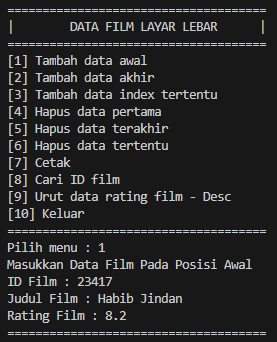 
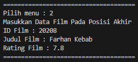 
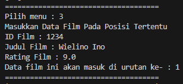 
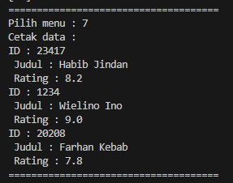 
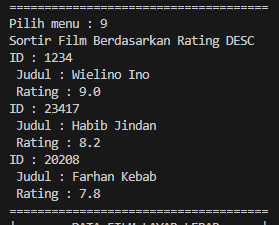 
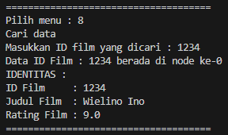
