# 
  LAPORAN PRAKTIKUM ALGORITMA DAN STRUKTUR DATA 
 
  

    

 

 Nama  : Luthfi Triaswangga 

 NIM   : 2341720208 

 Prodi : TEKNIK INFOMATIKA

 Kelas : 1B 

  
<b>2.1 Percobaan 1 : Deklarasi Class, Atribut, dan Method</b>

1. Pertama buat file dengan format Buku17.java

    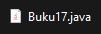

2. Kemudian tambahkan Class Buku dengan Atribut

    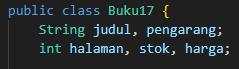

3. Lalu tambahkan Class Buku dengan Method

    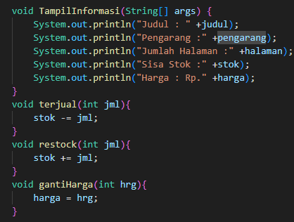

4. Maka hasilnya akan seperti ini

    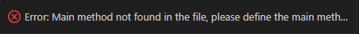

     

<b>2.11 Pertanyaan 1</b>

1. Sebutkan dua karakteristik Class atau Object!

<b>Encapsulation (Enkapsulasi): Enkapsulasi adalah konsep yang mengacu pada pembungkusan (wrapping) data dan metode (methods) yang bekerja pada data ke dalam satu unit tunggal, yaitu kelas, dan Inheritance (Warisan): Warisan adalah konsep di mana sebuah kelas dapat mewarisi sifat-sifat (data dan metode) dari kelas lain.
</b>

2. Perhatikan class Buku pada Praktikum 1 tersebut, ada berapa atribut yang dimiliki oleh class
Buku? Sebutkan apa saja atributnya!
<b>
Ada lima Atribut : 

* String judul
* String pengarang
* int halaman
* int stok
* int harga</b>

3. Ada berapa method yang dimiliki oleh class tersebut? Sebutkan apa saja methodnya!
<b>
Ada empat Method :

* TampilInformasi(string[] args)
* terjual(int jml)
* restock(int jml)
* gantiHarga(int hrg)</b>

4. Perhatikan method terjual() yang terdapat di dalam class Buku. Modifikasi isi method tersebut
sehingga proses pengurangan hanya dapat dilakukan jika stok masih ada (lebih besar dari 0)!
<b>
Berikut adalah hasil kode program yang sudah saya modifikasi 
</b>
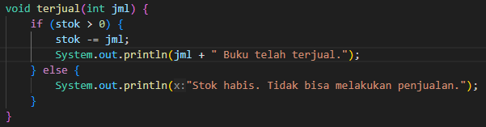
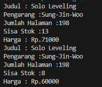

5. Menurut Anda, mengapa method restock() mempunyai satu parameter berupa bilangan int
<b> Karena parameter tersebut digunakan untuk menentukan jumlah buku yang akan ditambahkan ke dalam stok buku. Dengan menggunakan parameter ini, pengguna dapat menentukan jumlah buku yang ingin ditambahkan saat melakukan operasi restock.</b>

6. Commit dan push kode program ke Github

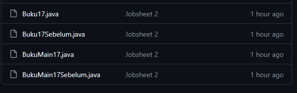

 

<b>2.2 Percobaan 2 : Instansi Object, serta mengakses Atribut dan Method</b>

1. Pertama buat file dengan format BukuMain17.java

    

2. Kemudian tambahkan struktur data dan fungsi main() lalu tambahkan Atribut dan Method di dalamnya

    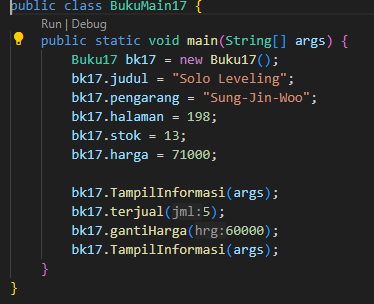

3. Lalu jalankan programnya

    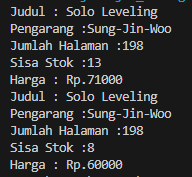
4. Terakhir Commit dan Push ke GitHub

    
  

<b>2.21 Pertanyaan 2</b>

1. Pada class BukuMain, tunjukkan baris kode program yang digunakan untuk proses instansiasi!
Apa nama object yang dihasilkan?

<b>Nama objek yang dihasilkan adalah <i>bk17</i></b>

2. Bagaimana cara mengakses atribut dan method dari suatu objek?

<b> untuk mengakses method dari suatu objek penggunaan kedua aksi tersebut sudah diperlihatkan. Misalnya, untuk mengakses atribut judul buku dari objek bk17, Anda menggunakan bk17.judul, dan untuk memanggil method TampilInformasi() dari objek bk17, Anda menggunakan bk17.TampilInformasi(args).
</b>

3. Mengapa hasil output pemanggilan method tampilInformasi() pertama dan kedua berbeda?

<b>Karena pemanggilan method TampilInformasi() pertama dan kedua mungkin berbeda karena ada perubahan yang dilakukan pada objek bk17 di antara dua pemanggilan tersebut.
</b>

 
<b>2.3 Percobaan 3 : Membuat Konstruktor</b>

1. Buka kembali Class Buku17 lalu tambahkan dua buah Konstruktor
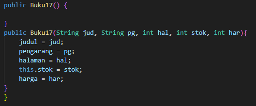

2. Kemudian buka kembali Class BukuMain17 lalu buat object bernama bk172 

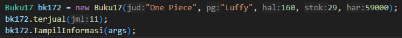

3. Maka hasilnya akan seperti dibawah ini

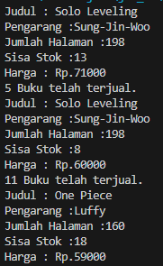
4. Push dan Commit ke GitHub

<b>2.32 Pertanyaan 3 </b>
1. Pada class Buku di Percobaan 3, tunjukkan baris kode program yang digunakan untuk
mendeklarasikan konstruktor berparameter!

2. Perhatikan class BukuMain. Apa sebenarnya yang dilakukan pada baris program berikut?
<b><i>
Buku17 bk172 = new Buku17("One Piece", "Luffy", 160, 29, 59000);</b>
</i>
3. Hapus konstruktor default pada class Buku, kemudian compile dan run program. Bagaimana
hasilnya? Jelaskan mengapa hasilnya demikian!

<b>Maka yang terjadi akan error

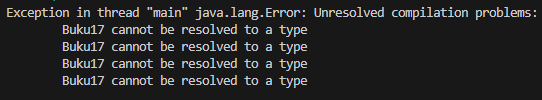
Karena setelah menghapus konstruktor default, Anda harus secara eksplisit menyediakan konstruktor lain jika ingin membuat objek dari kelas tersebut.</b>

4. Setelah melakukan instansiasi object, apakah method di dalam class Buku harus diakses
secara berurutan? Jelaskan alasannya!

<b>Tidak, Method di dalam Class Buku17 tidak harus diakses secara berurutan setelah melakukan instansiasi objek.

Karena dalam pemrograman Java, urutan pemanggilan method tidak mempengaruhi hasil dari eksekusi program, kecuali ada ketergantungan antara method tersebut yang membutuhkan urutan tertentu.</b>

5. Buat object baru dengan nama buku NamaMahasiswa menggunakan konstruktor
berparameter dari class Buku!

<b><i>Buku17 bkLuthfi = new Buku17("Ghibli", "Luthfi", 150, 20, 45000);

</i>
Lalu jika ingin menampilkan objek tersebut bisa dipanggil dengan menggunakan bkLuthfi.TampilInformasi();
6. Commit dan Push ke GitHub

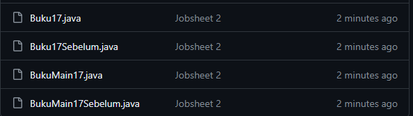
