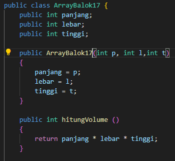

# 
  LAPORAN PRAKTIKUM III ALGORITMA DAN STRUKTUR DATA 
 
  

    

 

 Nama  : Luthfi Triaswangga 

 NIM   : 2341720208 

 Prodi : TEKNIK INFOMATIKA

 Kelas : 1B 

  

<b>3.1 Percobaan 1 : Membuat Array dari Object, Mengisi dan Menampilkan</b>

1. Pertama buat file baru dengan format ArrayObjects17.java

2. Kemudian tambahkan Class PersegiPanjang

3. Lalu Buat Array PersegiPanjang dengan 3 Elemen

4. Lalu tambahkan Class Persegi Panjang dengan Atribut

5. Terakhir cetak semua Atribut ke object ppArray

6. Dan ini Outputnya

<b> 3.11 Pertanyan 1</b>

1. Berdasarkan uji coba 3.2, apakah class yang akan dibuat array of object harus selalu memiliki 
atribut dan sekaligus method?Jelaskan!
<b>
Tidak, class yang akan dibuat sebagai array of object tidak harus memiliki atribut dan method. Array of object dapat digunakan untuk menyimpan instansi dari class mana pun, baik itu memiliki atribut dan method atau tidak.</b>
2. Apakah class PersegiPanjang memiliki konstruktor?Jika tidak, kenapa dilakukan pemanggilan 
konstruktur pada baris program berikut : 
<i>ppArray[1] = new PersegiPanjang();</i><b>

Tidak, class PersegiPanjang tidak secara eksplisit mendefinisikan konstruktor. Maka akan ada konstruktor default yang disediakan oleh Java secara otomatis.</b>
3. Apa yang dimaksud dengan kode berikut ini: 
<i>PersegiPanjang[] ppArray = new PersegiPanjang[3];</i>
4. Apa yang dimaksud dengan kode berikut ini: 
<i>
        ppArray[1] = new PersegiPanjang();

        ppArray[1].panjang = 80;

        ppArray[1].lebar = 40;</i><b>

</b>

5. Mengapa class main dan juga class PersegiPanjang dipisahkan pada uji coba 3.2?
<b>
Karena dengan memisahkannya class PersegiPanjang dapat fous pada operasi yang berkaitan dengan Persegi Panjang itu sendiri, sedangkan class main akan meningkatkan keterbacaan dan pemeliharaan kode</b>

<b>3.2 Percobaan 2 : Menerima Input Isisan Array Menggunakan Looping</b>

1. Tambahkan Import Scanner pada Class ArrayObjects

2. Membut Object Scanner untuk menerima input

3. Melakukan Looping untuk mengakses isi array ppArray

4. Dan ini Outputnya

<b>3.21 Pertanyaan 2</b>
1. Apakah array of object dapat diimplementasikan pada array 2 Dimensi?<b>

Ya, array of objects dapat diimplementasikan dalam array 2 dimensi.</b>
2. Jika jawaban soal no satu iya, berikan contohnya! Jika tidak, jelaskan<b>

Contohnya yaitu : 'ppArray' adalah array 2 dimensi yang berisi objek-objek 'PersegiPanjang'.</b>
3. Jika diketahui terdapat class Persegi yang memiliki atribut sisi bertipe integer, maka kode 
dibawah ini akan memunculkan error saat dijalankan. Mengapa? : 
<i>Persegi[] pgArray = new Persegi[100];

pgArray[5].sisi = 20;</i><b>

</b>
4. Modifikasi kode program pada praktikum 3.3 agar length array menjadi inputan dengan Scanner!
5. Apakah boleh Jika terjadi duplikasi instansiasi array of objek, misalkan saja instansiasi dilakukan 
pada ppArray[i] sekaligus ppArray[0]?Jelaskan !

<b>3.3 Percobaan 3 : Penambahan Operasi Matematika di Dalam Method</b>

1. Pertama Buat File baru dengan Format ArrayBalok17.java

2. Kemudian tambahkan Class Balok

3. Pada Class Balok buatlah 3elemen

4. Lalu tambahkan bilArray untuk konstruktor pada class Balok

5. Terakhir tampilkan hitungVolume() di dalam looping

6. Dan inilah Outputnya

<b>3.31 Pertanyaan 3</b>

1. Dapatkah konstruktor berjumlah lebih dalam satu kelas? Jelaskan dengan contoh!
2. Jika diketahui terdapat class Segitiga seperti berikut ini: 
<b><i>public class Segitiga {

    public int alas;

    public int tinggi;
}</i></b>
Tambahkan konstruktor pada class Segitiga tersebut yang berisi parameter int a, int t
yang masing-masing digunakan untuk mengisikan atribut alas dan tinggi.
3. Tambahkan method hitungLuas() dan hitungKeliling() pada class Segitiga
tersebut. Asumsi segitiga adalah segitiga siku-siku. (Hint: Anda dapat menggunakan bantuan 
library Math pada Java untuk mengkalkulasi sisi miring)
4. Pada fungsi main, buat array Segitiga sgArray yang berisi 4 elemen, isikan masing-masing 
atributnya sebagai berikut:

sgArray ke-0 alas: 10, tinggi: 4

sgArray ke-1 alas: 20, tinggi: 10

sgArray ke-2 alas: 15, tinggi: 6

sgArray ke-3 alas: 25, tinggi: 10

5. Kemudian menggunakan looping, cetak luas dan keliling dengan cara memanggil method 
hitungLuas() dan hitungKeliling().

<b>3.4 Praktikum Latihan 