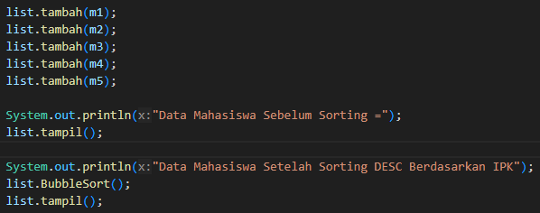
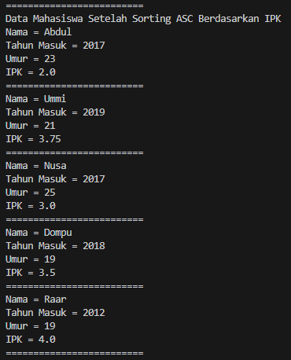
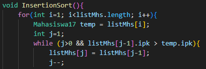

# 
  LAPORAN PRAKTIKUM V ALGORITMA DAN STRUKTUR DATA 
 
  

    

 

 Nama  : Luthfi Triaswangga 

 NIM   : 2341720208 

 Prodi : TEKNIK INFOMATIKA

 Kelas : 1B 

 

<b>5.11 Percobaan 1 : Bubble Sort</b>

1. Pertama Buat Class <i>Mahasiswa</i> 

2. Kemudian Tambahkan Atribut, Konstruktor dan Methode 

3. Setelah itu buat class <i>DaftarMaPres</i> 

4. Lalu Tambahkan Method <i>Tambah()</i> 
5. Kemudian Tambahkan Method <i>Tampil()</i> 

6. Lalu Tambahkan Method <i>BubbleSort()</i> 

7. Setelah itu buat class <i>Main</i> 

8. Terakhir Tampilkan fungsi <i>BubbleSort</i> 

9. Dan inilah Outputnya 

<b>5.11 Pertanyaan 1</b>

1. Terdapat di method apakah proses bubble sort?
2. Di dalam method bubbleSort(), terdapat baris program seperti di bawah ini <i>
if(listMhs[j].ipk > listMhs[j-1].ipk){ 
    Mahasiswa17 tmp = listMhs[j]; 
    listMhs[j] = listMhs[j-1]; 
    listMhs[j-1] = tmp; 
} </i>
Untuk apakah proses tersebut?
3. Perhatikan perulangan di dalam bubbleSort() di bawah ini: <i>
for(int i=0; i<listMhs.length-1; i++){ 
for(int j=1; j<listMhs.length-i; j++){ </i>
a. Apakah perbedaan antara kegunaan perulangan i dan perulangan j?  
b. Mengapa syarat dari perulangan i adalah i<listMhs.length-1 ? 
c. Mengapa syarat dari perulangan j adalah j<listMhs.length-i ? 
d. Jika banyak data di dalam listMhs adalah 50, maka berapakali perulangan i akan 
berlangsung? Dan ada berapa Tahap bubble sort yang ditempuh

<b>5.2 Percobaan 2 : Selection Sort</b>

1. Tambahkan method <i>SelectionSort</i> secara ascending 

2. Kemudian Tambahkan Method Selection Sort di class Main 

3. Dan ini adalah hasil outputnya 

<b>5.21 Pertanyaan 2</b>

Di dalam method selection sort, terdapat baris program seperti di bawah ini: <i>
for(int i=0; i<listMhs.length-1; i++){ 
    int idxMin = 1; 
    for(int j=i+1; j<listMhs.length; j++){ 
        if(listMhs[j].ipk < listMhs[idxMin].ipk){ 
        idxMin = j; </i>
Untuk apakah proses tersebut, jelaskan! 

<b>5.3 Percobaan 3 : Insertion Sort</b>

1. Tambahkan method <i>InsertionSort</i> secara ascending 

2. Kemudian Tambahkan Method Insertion Sort di class Main 

3. Dan ini adalah hasil outputnya 

<b>5.31 Pertanyaan 3</b>

Ubahlah fungsi pada InsertionSort sehingga fungsi ini dapat melaksanakan proses sorting 
dengan cara descending