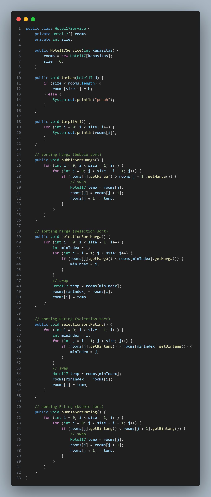

# 
  LAPORAN PRAKTIKUM IV ALGORITMA DAN STRUKTUR DATA 
 
  

    

 

 Nama  : Luthfi Triaswangga 

 NIM   : 2341720208 

 Prodi : TEKNIK INFOMATIKA

 Kelas : 1B 

 

<b>4.1 Percobaan 1 : Menghitung Nilai Faktorial dengan Algoritma Brute Force dan Divide and Conquer </b>

1. Buat Class <i>Faktorial</i>

2. Kemudian Tambahkan method <i>faktoBF()</i> nilai

3. Lalu Tambahkan method <i>faktoDC()</i> nilai

4. Setelah semuanya selesai Buatlah Class <i>MainFaktorial</i>

5. Kemudian Buat Array of Objek pada fungsi main

6. Terakhir tampilkan method <i>FaktoBF</i> dan <i>FaktoDC</i>

7. Maka hasilnya akan seperti ini

<b>4.11 Pertanyaan 1</b>

1. Pada base line Algoritma Divide Conquer untuk melakukan pencarian nilai faktorial, jelaskan
perbedaan bagian kode pada penggunaan if dan else!
2. Apakah memungkinkan perulangan pada method faktorialBF() dirubah selain menggunakan
for?Buktikan!
3. Jelaskan perbedaan antara fakto *= i; dan int fakto = n * faktorialDC(n-1); !

<b>4.2 Percobaan 2 : Menghitung Hasil Pangkat dengan Algoritma Brute Force dan Divide and Conquer</b>

1. Buat Class Pangkat

2. Kemudian buat method <i>PangkatBF</i>

3. Lalu tambahkan method <i>PangkatDC</i>

4. Setelah semuanya selesai Buatlah Class <i>MainPangkat</i>

5. Kemudian Buat Array of Objek pada fungsi main

6. Terakhir tampilkan method <i>FaktoBF</i> dan <i>FaktoDC</i>

7. Maka hasilnya akan seperti ini

<b>4.21 Pertanyaan 2</b>

1. Jelaskan mengenai perbedaan 2 method yang dibuat yaitu PangkatBF() dan PangkatDC()!
2. Apakah tahap combine sudah termasuk dalam kode tersebut?Tunjukkan!
3. Modifikasi kode program tersebut, anggap proses pengisian atribut dilakukan dengan
konstruktor.
4. Tambahkan menu agar salah satu method yang terpilih saja yang akan dijalankan menggunakan
switch-case!

<b>4.3 Percobaan 3 : Menghitung Sum Array dengan Algoritma Brute Force dan Divide and Conquer</b>

1. Buat class sum

2. Kemudian tambahkan method <i>sumBF</i>

3. Lalu tambahkan method <i>sumDC</i>

4. Setelah semuanya selesai Buatlah Class MainSum

5. Kemudian Buat Array of Objek pada fungsi main

6. Terakhir tampilkan method sumBF dan sumDC

7. Maka hasilnya akan seperti ini

<b>4.31 Pertanyaan 3</b>
1. Mengapa terdapat formulasi return value berikut?Jelaskan! <i>return lsum+rsum+arr[mid];</i>
2. Kenapa dibutuhkan variable <i>mid</i> pada method <i>TotalDC()?</i>
3. Program perhitungan keuntungan suatu perusahaan ini hanya untuk satu perusahaan saja.
Bagaimana cara menghitung sekaligus keuntungan beberapa bulan untuk beberapa
perusahaan.(Setiap perusahaan bisa saja memiliki jumlah bulan berbeda-beda)? Buktikan
dengan program!