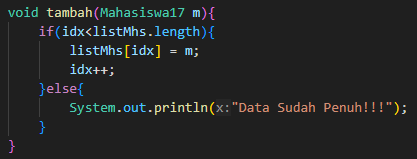
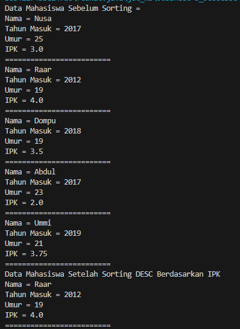
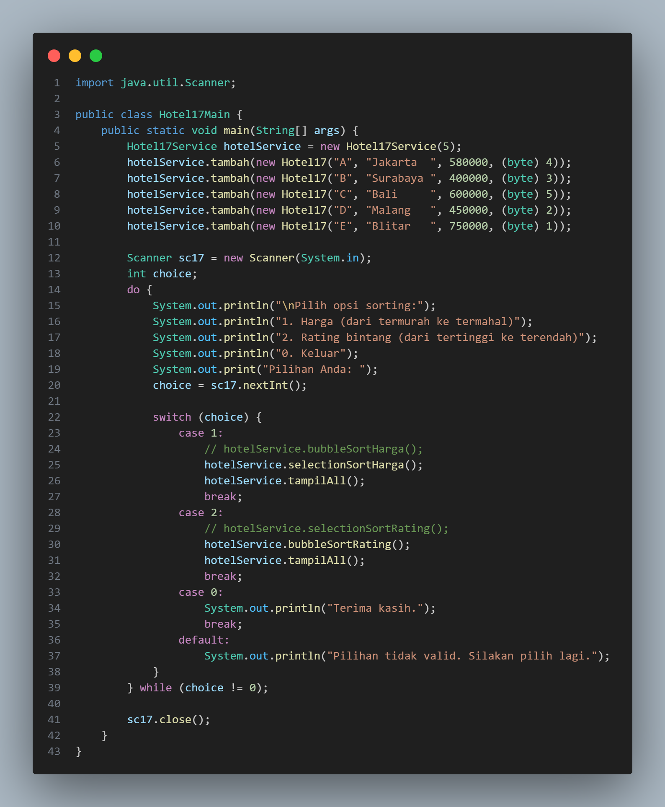
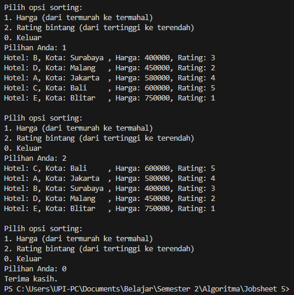

# 
  LAPORAN PRAKTIKUM IV ALGORITMA DAN STRUKTUR DATA 
 
  

    

 

 Nama  : Luthfi Triaswangga 

 NIM   : 2341720208 

 Prodi : TEKNIK INFOMATIKA

 Kelas : 1B 

 

<b>4.1 Percobaan 1 : Menghitung Nilai Faktorial dengan Algoritma Brute Force dan Divide and Conquer </b>

1. Buat Class <i>Faktorial</i> 

2. Kemudian Tambahkan method <i>faktoBF()</i> nilai 

3. Lalu Tambahkan method <i>faktoDC()</i> nilai 

4. Setelah semuanya selesai Buatlah Class <i>MainFaktorial</i> 

5. Kemudian Buat Array of Objek pada fungsi main 

6. Terakhir tampilkan method <i>FaktoBF</i> dan <i>FaktoDC</i> 

7. Maka hasilnya akan seperti ini 

<b>4.11 Pertanyaan 1</b>

1. Pada base line Algoritma Divide Conquer untuk melakukan pencarian nilai faktorial, jelaskan
perbedaan bagian kode pada penggunaan if dan else! <b>
Pada algoritma Divide Conquer terdapat fungsi rekursif yang mengembalikan dirinya sendiri. Pada bagian if merupakan base case dari fungsi rekursif jika parameter bernilai 1. Pada bagian else dilakukan rekursif yang memanggil dirinya sendiri dengan parameter awal dikurangi 1</b>
2. Apakah memungkinkan perulangan pada method faktorialBF() dirubah selain menggunakan
for?Buktikan! <b>
Perulangan dapat digantikan dengan menggunakan perulangan while.</b> 

3. Jelaskan perbedaan antara fakto *= i; dan int fakto = n * faktorialDC(n-1); ! <b>
Pada fakto *= i dilakukan operasi assignment dalam iterasi namun pada fakto = n * faktorialDC(n-1) dilakukan proses rekursif</b>

<b>4.2 Percobaan 2 : Menghitung Hasil Pangkat dengan Algoritma Brute Force dan Divide and Conquer</b>

1. Buat Class Pangkat 

2. Kemudian buat method <i>PangkatBF</i> 

3. Lalu tambahkan method <i>PangkatDC</i> 

4. Setelah semuanya selesai Buatlah Class <i>MainPangkat</i> 

5. Kemudian Buat Array of Objek pada fungsi main 

6. Terakhir tampilkan method <i>FaktoBF</i> dan <i>FaktoDC</i> 

7. Maka hasilnya akan seperti ini 

<b>4.21 Pertanyaan 2</b>

1. Jelaskan mengenai perbedaan 2 method yang dibuat yaitu PangkatBF() dan PangkatDC()! <b>
Pada method PangkatBF terjadi penghitungan pangkat yang menggunakan algoritma Brute Force dengan menerapkan perhitungan per indeks pada perulangan. Sedangkan pada method PangkatDC menggunakan algoritma Devide Conquer yang membagi tiap bagian pangkat kemudian di hitung per bagian dan pada akhirnya di combine.</b>
2. Apakah tahap combine sudah termasuk dalam kode tersebut?Tunjukkan! <b>
Terdapat dalam method PangkatDC di bagian rekursif berikut : 
if (n % 2 == 1) { return (pangkatDC(a, n / 2) * pangkatDC(a, n / 2) * a); } else { return (pangkatDC(a, n / 2) * pangkatDC(a, n / 2));</b>
3. Modifikasi kode program tersebut, anggap proses pengisian atribut dilakukan dengan
konstruktor. <b>
Berikut adalah Kode modifikasi nya </b>
 

4. Tambahkan menu agar salah satu method yang terpilih saja yang akan dijalankan menggunakan
switch-case! <b>
Berikut adalah Kode Modifikasi nya </b>

<b>4.3 Percobaan 3 : Menghitung Sum Array dengan Algoritma Brute Force dan Divide and Conquer</b>

1. Buat class sum 

2. Kemudian tambahkan method <i>sumBF</i> 

3. Lalu tambahkan method <i>sumDC</i> 

4. Setelah semuanya selesai Buatlah Class MainSum 

5. Kemudian Buat Array of Objek pada fungsi main 

6. Terakhir tampilkan method sumBF dan sumDC 

7. Maka hasilnya akan seperti ini 

<b>4.31 Pertanyaan 3</b>
1. Mengapa terdapat formulasi return value berikut?Jelaskan! <i>return lsum+rsum+arr[mid];</i> <b>
Untuk mencombine hasil penjumlahan sisi kiri (lsum), sisi kanan (rsum) dan bagian tengah (arr[mid]).</b>
2. Kenapa dibutuhkan variable <i>mid</i> pada method <i>TotalDC()?</i> <b>
Untuk membagi array menjadi dua bagian sama panjang.</b>
3. Program perhitungan keuntungan suatu perusahaan ini hanya untuk satu perusahaan saja.
Bagaimana cara menghitung sekaligus keuntungan beberapa bulan untuk beberapa
perusahaan.(Setiap perusahaan bisa saja memiliki jumlah bulan berbeda-beda)? Buktikan
dengan program! <b>
Berikut adalah Kode Modifikasi nya 

Dan ini adalah Hasil dari kode program tersebut</b> 

<b>Latihan JS 4</b>

Tentukan:
1. top_acceleration tertinggi menggunakan Divide and Conquer!
2. top_acceleration terendah menggunakan Divide and Conquer!
3. Rata-rata top_power dari seluruh mobil menggunakan Brute Force!

Berikut adalah kode programnya : 

Berikut adalah kode program main : 

Dan inilah hasil dari kode program tersebut :
