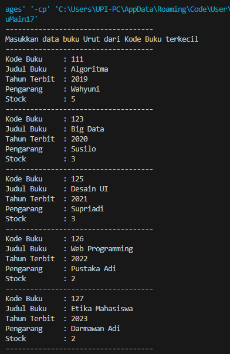

# 
  LAPORAN PRAKTIKUM VI ALGORITMA DAN STRUKTUR DATA 
 
  

    

 

 Nama  : Luthfi Triaswangga 

 NIM   : 2341720208 

 Prodi : TEKNIK INFOMATIKA

 Kelas : 1B 

 

<b>6.1 Percobaan 1 : Sequential Search</b>

Kode Program :

 
 
 

Hasil Kode Program : 

 
 
 

<b>6.11 Pertanyaan 1</b>

1. Jelaskan fungsi break yang ada pada method FindSeqSearch! 
<b>Jawab : Untuk menghentikan perulangan ketika telah menemukan nilai cari pada kumpulan atribut kode buku di array of object.</b> 
2. Jika Data Kode Buku yang dimasukkan tidak terurut dari kecil ke besar. Apakah program masih 
dapat berjalan? Apakah hasil yang dikeluarkan benar? Tunjukkan hasil screenshoot untuk bukti 
dengan kode Buku yang acak. Jelaskan Mengapa hal tersebut bisa terjadi? 
<b>Jawab : Iya, program masih dapat berjalan karena sequential search mencari nilai pada setiap indeks, tidak perlu urut.</b> 
 

3. Buat method baru dengan nama FindBuku menggunakan konsep sequential search dengan tipe 
method dari FindBuku adalah BukuNoAbsen. Sehingga Anda bisa memanggil method 
tersebut pada class BukuMain seperti gambar berikut  
<i>Buku dataBuku = data.FindBuku(cari); 
dataBuku.tampilDataBuku;</i> 
 
 
 

<b>6.2 Percobaan 2 : Binary Search</b>

Kode Program :

 
 

Hasil Kode Program : 

 

<b>Pertanyaan 2 : Binary Search</b>

1. Tunjukkan pada kode program yang mana proses divide dijalankan! <b>
Jawab : Ketika program membagi suatu data menjadi dua bagian antara kiri dan kanan yang dipisahkan oleh variable mid <i>
if (right >= left) { mid = (left + right) / 2; }</b></i>
2. Tunjukkan pada kode program yang mana proses conquer dijalankan! <b>
Jawab : Ketika mulai menemukan hasil dari tiap bagian pada pemanggilan rekursif <i>
if (cari == listBk[mid].kodeBuku) { return (mid); } else if (listBk[mid].kodeBuku > cari) { return FindBinarySearch(cari, left, mid); } else { return FindBinarySearch(cari, mid, right); }</b></i>
4. Jika data Kode Buku yang dimasukkan tidak urut. Apakah program masih dapat berjalan? Mengapa 
demikian! Tunjukkan hasil screenshoot untuk bukti dengan kode Buku yang acak. Jelaskan 
Mengapa hal tersebut bisa terjadi? <b>
Jawab : Program bisa berjalan namun hasil tidak ditemukan, karena metode binary search mencari nilai pada index tengah kemudian dibandingkan dengan nilai yang ingin dicari, jika nilai yang dicari lebih kecil dari pada tengah akan dilakukan pengecekan bagian kiri (jika ascending) namun jika nilai yang dicari lebih besar dari bagian tengah maka akan dilakukan pencarian di bagian kanan.</b> 
 
 
3. Jika Kode Buku yang dimasukkan dari Kode Buku terbesar ke terkecil (missal : 20215, 20214, 
20212, 20211, 20210) dan elemen yang dicari adalah 20210. Bagaimana hasil dari binary search? 
Apakah sesuai? Jika tidak sesuai maka ubahlah kode program binary seach agar hasilnya sesuai! <b>
Jawab : Hasil tidak sesuai dikarenakan data tidak urut, cara mengubahnya adalah mengurutkan data nya terlebih dahulu.</b> 
 
 

<b>Percobaan 3 : Merge Sort</b>

Kode Program : 

 
 

Hasil Kode Program :
