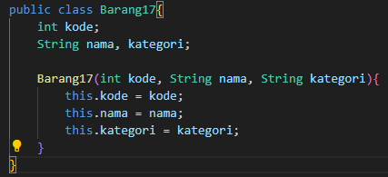
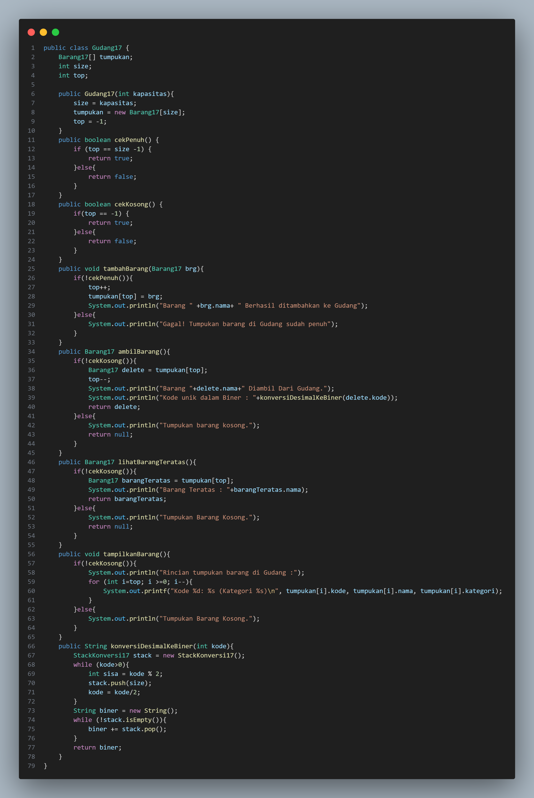
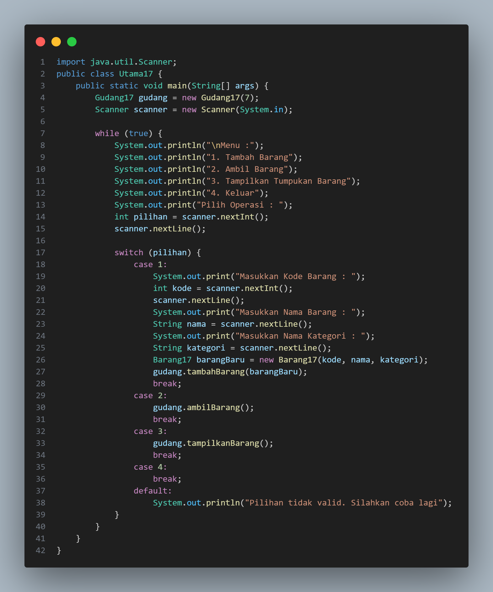
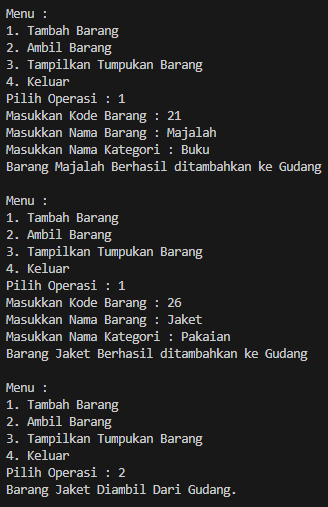
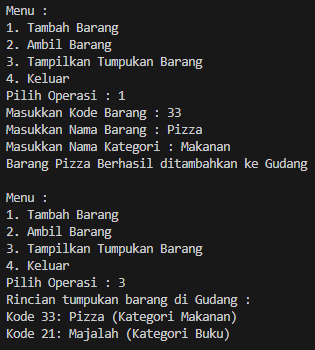
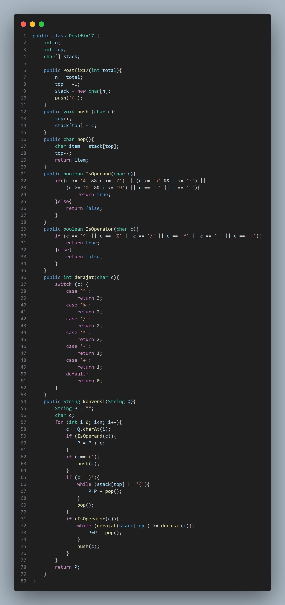
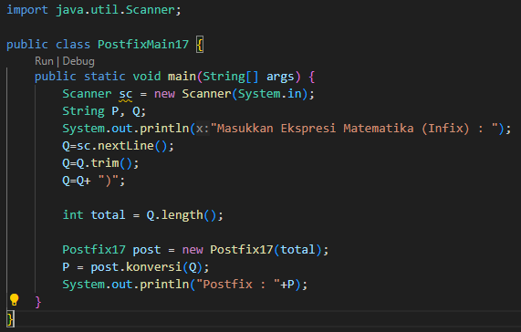
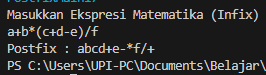

# 
  LAPORAN PRAKTIKUM VII ALGORITMA DAN STRUKTUR DATA 
 
  

    

 

 Nama  : Luthfi Triaswangga 

 NIM   : 2341720208 

 Prodi : TEKNIK INFOMATIKA

 Kelas : 1B 

 

<b>7.1 Percobaan 1 : Penyimpanan Tumpukan</b>

Kode Program Barang 
 
Kode Program Gudang 
 
Kode Program Utama 
 
Hasil Kode Program 
 
 

<b>7.11 Pertanyaan 1 : Penyimpanan Tumpukan</b>
1. Lakukan perbaikan pada kode program, sehingga keluaran yang dihasilkan sama dengan verifikasi 
hasil percobaan! Bagian mana saja yang perlu diperbaiki? <b>
Jawab :  
Pada file Gudang17.java terdapat Kode Program :  <i>
public Barang17 lihatBarangTeratas(){ 
if(!isEmpty()){}}</i> 
Yang sebelumnya isEmpty kita ganti menjadi <i>if(!cekKosong)(){}</i> karena pada Kode File Gudang17 tidak terdapat method isEmpty.</b>
2. Berapa banyak data barang yang dapat ditampung di dalam tumpukan? Tunjukkan potongan kode 
programnya!
3. Mengapa perlu pengecekan kondisi !cekKosong() pada method tampilkanBarang? Kalau kondisi 
tersebut dihapus, apa dampaknya?
4. Modifikasi kode program pada class Utama sehingga pengguna juga dapat memilih operasi lihat 
barang teratas, serta dapat secara bebas menentukan kapasitas gudang!
5. Commit dan push kode program ke Github

<b>7.2 Percobaan 2 : Konversi Kode Ke Biner</b>

<b>7.21 Pertanyaan 2 : Konversi Kode Ke Biner</b>

1. Pada method konversiDesimalKeBiner, ubah kondisi perulangan menjadi while (kode != 0), 
bagaimana hasilnya? Jelaskan alasannya!
2. Jelaskan alur kerja dari method konversiDesimalKeBiner

<b>Percobaan 3 : Konversi Iflix Ke Postfix</b>

Kode Program Postfix 

 
Kode Program PostfixMain 
 
Hasil Kode Program 
 

<b>Pertanyaan 3 : Konversi Iflix Ke Postfix</b>
1. Pada method derajat, mengapa return value beberapa case bernilai sama? Apabila return 
value diubah dengan nilai berbeda-beda setiap case-nya, apa yang terjadi?
2. Jelaskan alur kerja method konversi!
3. Pada method konversi, apa fungsi dari potongan kode berikut!? 
c = Q.charAt(); <b> 