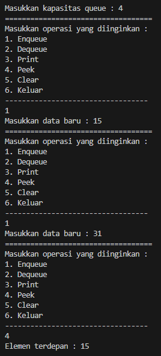
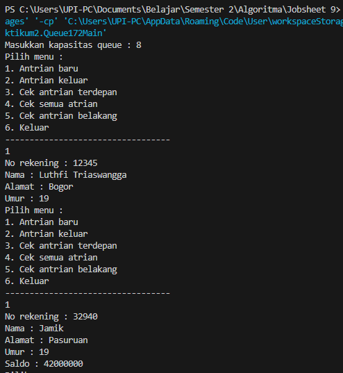
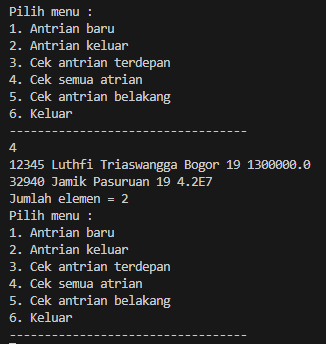
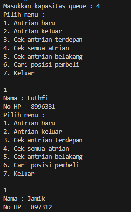
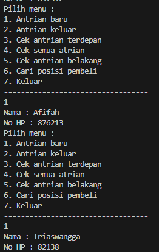
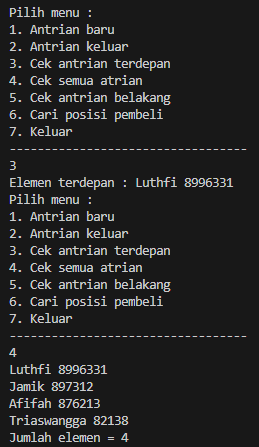
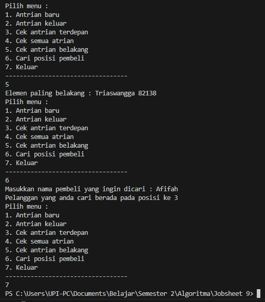

# 
  LAPORAN PRAKTIKUM IX ALGORITMA DAN STRUKTUR DATA 
 
  

    

 

 Nama  : Luthfi Triaswangga 

 NIM   : 2341720208 

 Prodi : TEKNIK INFOMATIKA

 Kelas : 1B 

 

<b>Praktikum 1 : Queue</b> 
Kode Program Class Queue 

   package Praktikum1;

   public class Queue17 {
    int[] data;
    int front, rear, size, max;

    Queue17(int n) {
        max = n;
        data = new int[max];
        size = 0;
        front = rear = -1;
    }

    public boolean isFull() {
        if (size == max) {
            return true;
        } else {
            return false;
        }
    }

    public boolean isEmpty() {
        if (size == 0) {
            return true;
        } else {
            return false;
        }
    }

    void enqueue(int dt) {
        if (isFull()) {
            System.out.println("Queue sudah penuh");
            System.exit(1);
        } else {
            if (isEmpty()) {
                front = rear = 0;
            } else {
                if (rear == max - 1) {
                    rear = 0;
                } else {
                    rear++;
                }
            }
            data[rear] = dt;
            size++;
        }
    }

    public int dequeue() {
        int dt = 0;
        if (isEmpty()) {
            System.out.println("Queue masih kosong");
            System.exit(1);
        } else {
            dt = data[front];
            size--;
            if (isEmpty()) {
                front = rear = -1;
            } else {
                if (front == max - 1) {
                    front = 0;
                } else {
                    front++;
                }
            }
        }
        return dt;
    }

    void peek() {
        if (!isEmpty()) {
            System.out.println("Elemen terdepan : " + data[front]);
        } else {
            System.out.println("Queue masih kosong");
        }
    }

    void print() {
        if (isEmpty()) {
            System.out.println("Queue masih kosong");
        } else {
            int i = front;
            while (i != rear) {
                System.out.print(data[i] + " ");
                i = (i + 1) % max;
            }
            System.out.println(data[i] + " ");
            System.out.println("Jumlah elemen = " + size);
        }
    }

    void clear() {
        if (!isEmpty()) {
            front = rear = -1;
            size = 0;
            System.out.println("Queue berhasil dikosongkan");
        } else {
            System.out.println("Queue masih kosong");
        }
    }
    }

 Kode Program Class Main

    package Praktikum1;
    import java.util.Scanner;

    public class QueueMain17 {

    public static void menu() {
        System.out.println("Masukkan operasi yang diinginkan : ");
        System.out.println("1. Enqueue");
        System.out.println("2. Dequeue");
        System.out.println("3. Print");
        System.out.println("4. Peek");
        System.out.println("5. Clear");
        System.out.println("6. Keluar");
        System.out.println("----------------------------------");
    }

    public static void main(String[] args) {
        Scanner sc17 = new Scanner(System.in);
        System.out.print("Masukkan kapasitas queue : ");
        int n = sc17.nextInt();

        Queue17 Q = new Queue17(n);

        int pilih = 0;
        do {
            menu();
            pilih = sc17.nextInt();
            switch (pilih) {
                case 1:
                    System.out.print("Masukkan data baru : ");
                    int dataMasuk = sc17.nextInt();
                    Q.enqueue(dataMasuk);
                    break;
                case 2 :
                    int dataKeluar = Q.dequeue();
                    if (dataKeluar != 0) {
                        System.out.println("Data yang dikeluarkan : " + dataKeluar);
                    }
                    break;
                case 3 : 
                    Q.print();
                    break;
                case 4 : 
                    Q.peek();
                    break;
                case 5 : 
                    Q.clear();
                    break;
                default:
                    break;
            }
        } while (pilih == 1 || pilih == 2 || pilih == 3 || pilih == 4 || pilih == 5);
    }
    }

 Hasil Kode Program 
 

<b>Pertanyaan 1 : Queue</b> 

1. Pada konstruktor, mengapa nilai awal atribut front dan rear bernilai -1, sementara atribut size bernilai 0?
Jawab : Karena data dalam queue masih kosong, -1 digunakan sebagai penanda tidak ada indeks dalam queue kosong dengan size 0.
2. Pada method Enqueue, jelaskan maksud dan kegunaan dari potongan kode berikut!
if (rear == max - 1) {
    rear = 0;
Jawab : Baris kode if (rear == max - 1) { rear = 0; } dalam method enqueue memiliki fungsi untuk mengecek apakah sudah mencapai batas maksimum dari antrian atau queue yang dimiliki. Jika sudah mencapai batas itu, yang berarti tidak ada tempat lagi untuk menambahkan elemen baru di bagian belakang antrian, maka kode ini akan membantu kita untuk kembali lagi ke bagian awal dari antrian. Dan jika bagian awal tersebut masih kosong, kita bisa menambah data baru di tempat rear atau di bagian awal.
3. Pada method Dequeue, jelaskan maksud dan kegunaan dari potongan kode berikut!

if (front == max - 1) {
    front = 0;
Jawab : ketika telah mencapai ujung antrian (kondisi front == max - 1), artinya front berada di akhir array. Dengan kode front = 0; front akan kembali ke awal array, sehingga kita dapat terus menggunakan ruang kosong di awal antrian setelah menghapus elemen-elemen.
4. Pada method print, mengapa pada proses perulangan variabel i tidak dimulai dari 0 (int i=0), melainkan int i=front?
Jawab : Karena dalam konsep queue, data yang masuk terlebih dahulu akan dikeluarkan terlebih dahulu, dan front merupakan indikasi data awal. Sedangkan data awal tidak selalu berada pada indeks ke 0
5. Perhatikan kembali method print, jelaskan maksud dari potongan kode berikut!

i = (i + 1) % max;
Jawab : mencetak semua elemen antrian dalam urutan yang benar bahkan jika antrian tersebut menggunakan struktur data queue. Jika seumpama kita ingin mencetak indeks ke 0 setelah indeks terakhir, increment tersebut berguna untuk kasus itu.
6. Tunjukkan potongan kode program yang merupakan queue overflow!
Pada saat akan menambahkan elemen baru dilakukan terlebih dahulu apakah queue sudah penuh atau belum menggunakan isFull()

void enqueue(int dt) {
    if (isFull()) {
        System.out.println("Queue sudah penuh");
    }
7 . Pada saat terjadi queue overflow dan queue underflow, program tersebut tetap dapat berjalan dan hanya menampilkan teks informasi. Lakukan modifikasi program sehingga pada saat terjadi queue overflow dan queue underflow, program dihentikan!

void enqueue(int dt) {
        if (isFull()) {
            System.out.println("Queue sudah penuh");
            System.exit(1);
        } else {
            if (isEmpty()) {
                front = rear = 0;
            } else {
                if (rear == max - 1) {
                    rear = 0;
                } else {
                    rear++;
                }
            }
            data[rear] = dt;
            size++;
        }
    }

    public int dequeue() {
        int dt = 0;
        if (isEmpty()) {
            System.out.println("Queue masih kosong");
            System.exit(1);
        } else {
            dt = data[front];
            size--;
            if (isEmpty()) {
                front = rear = -1;
            } else {
                if (front == max - 1) {
                    front = 0;
                } else {
                    front++;
                }
            }
        }
        return dt;
    }

<b>Praktikum 2 : Nasabah </b> 

 Kode Program Nasabah 

    package Praktikum2;

    public class Nasabah17 {
    String norek, nama, alamat;
    int umur;
    double saldo;

    Nasabah17(){
        
    }

    Nasabah17(String norek, String nama, String alamat, int umur, double saldo){
        this.norek = norek;
        this.nama = nama;
        this.alamat = alamat;
        this.umur = umur;
        this.saldo = saldo;
    }
    }

  Kode Program Class Queue 

    package Praktikum2;

    public class Queue172 {
    Nasabah17[] data;
    int front, rear, size, max;

    Queue172(int n) {
        max = n;
        data = new Nasabah17[max];
        size = 0;
        front = rear = -1;
    }

    public boolean isFull() {
        if (size == max) {
            return true;
        } else {
            return false;
        }
    }

    public boolean isEmpty() {
        if (size == 0) {
            return true;
        } else {
            return false;
        }
    }

    void enqueue(Nasabah17 dt) {
        if (isFull()) {
            System.out.println("Queue sudah penuh");
            System.exit(1);
        } else {
            if (isEmpty()) {
                front = rear = 0;
            } else {
                if (rear == max - 1) {
                    rear = 0;
                } else {
                    rear++;
                }
            }
            data[rear] = dt;
            size++;
        }
    }

    public Nasabah17 dequeue() {
        Nasabah17 dt = new Nasabah17();
        if (isEmpty()) {
            System.out.println("Queue masih kosong");
            System.exit(1);
        } else {
            dt = data[front];
            size--;
            if (isEmpty()) {
                front = rear = -1;
            } else {
                if (front == max - 1) {
                    front = 0;
                } else {
                    front++;
                }
            }
        }
        return dt;
    }

    void peek() {
        if (!isEmpty()) {
            System.out.println("Elemen terdepan : " + data[front].norek + " " + data[front].nama + " "
                    + data[front].alamat + " " + data[front].umur + " " + data[front].saldo);
        } else {
            System.out.println("Queue masih kosong");
        }
    }

    void peekRear() {
        if (!isEmpty()) {
            System.out.println("Elemen paling belakang : " + data[rear].norek + " " + data[rear].nama + " "
                    + data[rear].alamat + " " + data[rear].umur + " " + data[rear].saldo);
        } else {
            System.out.println("Queue masih kosong");
        }
    }
    
    void print() {
        if (isEmpty()) {
            System.out.println("Queue masih kosong");
        } else {
            int i = front;
            while (i != rear) {
                System.out.println(data[i].norek + " " + data[i].nama + " "
                        + data[i].alamat + " " + data[i].umur + " " + data[i].saldo);
                i = (i + 1) % max;
            }
            System.out.println(data[i].norek + " " + data[i].nama + " "
                    + data[i].alamat + " " + data[i].umur + " " + data[i].saldo);
            System.out.println("Jumlah elemen = " + size);
        }
    }

    void clear() {
        if (!isEmpty()) {
            front = rear = -1;
            size = 0;
            System.out.println("Queue berhasil dikosongkan");
        } else {
            System.out.println("Queue masih kosong");
        }
    }
    }

 Kode Program Queue Main 

    package Praktikum2;
    import java.util.Scanner;
    import Praktikum1.Queue17;

    public class Queue172Main {
    public static void menu() {
        System.out.println("Pilih menu : ");
        System.out.println("1. Antrian baru");
        System.out.println("2. Antrian keluar");
        System.out.println("3. Cek antrian terdepan");
        System.out.println("4. Cek semua atrian");
        System.out.println("5. Cek antrian belakang");
        System.out.println("6. Keluar");
        System.out.println("----------------------------------");
    }

    public static void main(String[] args) {
        Scanner sc17 = new Scanner(System.in);
        Scanner fi = new Scanner(System.in);
        System.out.print("Masukkan kapasitas queue : ");
        int jumlah = sc17.nextInt();

        Queue172 Q = new Queue172(jumlah);

        int pilih = 0;
        do {
            menu();
            pilih = sc17.nextInt();
            switch (pilih) {
                case 1:
                    System.out.print("No rekening : ");
                    String norek = fi.nextLine();
                    System.out.print("Nama : ");
                    String nama = fi.nextLine();
                    System.out.print("Alamat : ");
                    String alamat = fi.nextLine();
                    System.out.print("Umur : ");
                    int umur = sc17.nextInt();
                    System.out.print("Saldo : ");
                    int saldo = sc17.nextInt();
                    Nasabah17 nb = new Nasabah17(norek, nama, alamat, umur, saldo);
                    Q.enqueue(nb);
                    break;
                case 2:
                    Nasabah17 data = Q.dequeue();
                    if (!"".equals(data.norek) && !"".equals(data.nama) && !"".equals(data.alamat) && data.umur != 0
                            && data.saldo != 0) {
                        System.out.println("Data yang dikeluarkan : " + data.norek + " " + data.nama + " " + data.alamat
                                + " " + data.umur + " " + data.saldo);
                    }
                    break;
                case 3:
                    Q.peek();
                    break;
                case 4:
                    Q.print();
                    break;
                case 5:
                    Q.peekRear();
                    break;
                default:
                    break;
            }
        } while (pilih == 1 || pilih == 2 || pilih == 3 || pilih == 4 || pilih == 5);
    }
    }

 Hasil Kode Program 

 
 

<b>Pertanyaan 2 : Nasabah</b> 

1. Pada class QueueMain, jelaskan fungsi IF pada potongan kode program berikut!

if (!"".equals(data.norek) && !"".equals(data.nama) && !"".equals(data.alamat) && data.umur != 0 && data.saldo != 0) {
    System.out.println("Data yang dikeluarkan : " + data.norek + " " + data.nama + " " + data.alamat + " " + data.umur + " " + data.saldo);
    }
    break; 

Jawab : Memastikan bahwa data yang dikeluarkan dari queue setelah operasi dequeue adalah data yang valid dan tidak kosong, dan jika valid, data tersebut akan dicetak ke layar.

2. Lakukan modifikasi program dengan menambahkan method baru bernama peekRear pada class Queue yang digunakan untuk mengecek antrian yang berada di posisi belakang! Tambahkan pula daftar menu 5. Cek Antrian paling belakang pada class QueueMain sehingga method peekRear dapat dipanggil! 

Kode Program Queue Main 

    package Praktikum2;
    import java.util.Scanner;
    import Praktikum1.Queue17;

    public class Queue172Main {
    public static void menu() {
        System.out.println("Pilih menu : ");
        System.out.println("1. Antrian baru");
        System.out.println("2. Antrian keluar");
        System.out.println("3. Cek antrian terdepan");
        System.out.println("4. Cek semua atrian");
        System.out.println("5. Cek antrian belakang");
        System.out.println("6. Keluar");
        System.out.println("----------------------------------");
    }

    public static void main(String[] args) {
        Scanner sc17 = new Scanner(System.in);
        Scanner fi = new Scanner(System.in);
        System.out.print("Masukkan kapasitas queue : ");
        int jumlah = sc17.nextInt();

        Queue172 Q = new Queue172(jumlah);

        int pilih = 0;
        do {
            menu();
            pilih = sc17.nextInt();
            switch (pilih) {
                case 1:
                    System.out.print("No rekening : ");
                    String norek = fi.nextLine();
                    System.out.print("Nama : ");
                    String nama = fi.nextLine();
                    System.out.print("Alamat : ");
                    String alamat = fi.nextLine();
                    System.out.print("Umur : ");
                    int umur = sc17.nextInt();
                    System.out.print("Saldo : ");
                    int saldo = sc17.nextInt();
                    Nasabah17 nb = new Nasabah17(norek, nama, alamat, umur, saldo);
                    Q.enqueue(nb);
                    break;
                case 2:
                    Nasabah17 data = Q.dequeue();
                    if (!"".equals(data.norek) && !"".equals(data.nama) && !"".equals(data.alamat) && data.umur != 0
                            && data.saldo != 0) {
                        System.out.println("Data yang dikeluarkan : " + data.norek + " " + data.nama + " " + data.alamat
                                + " " + data.umur + " " + data.saldo);
                    }
                    break;
                case 3:
                    Q.peek();
                    break;
                case 4:
                    Q.print();
                    break;
                case 5:
                    Q.peekRear();
                    break;
                default:
                    break;
            }
        } while (pilih == 1 || pilih == 2 || pilih == 3 || pilih == 4 || pilih == 5);
    }
    }

<b>Tugas</b> 

Kode Program Pembeli 

    package Tugas;

    public class Pembeli17 {
    String nama;
    int noHP;

    Pembeli17() {

    }

    Pembeli17(String nama, int noHP) {
        this.nama = nama;
        this.noHP = noHP;
    }
    }

 Kode Program Queue 
    package Tugas;

    public class Queue17T {
    Pembeli17[] antrean;
    int front, rear, size, max;

    Queue17T(int n) {
        max = n;
        antrean = new Pembeli17[max];
        size = 0;
        front = rear = -1;
    }

    public boolean isFull() {
        if (size == max) {
            return true;
        } else {
            return false;
        }
    }

    public boolean isEmpty() {
        if (size == 0) {
            return true;
        } else {
            return false;
        }
    }

    void enqueue(Pembeli17 dt) {
        if (isFull()) {
            System.out.println("Queue sudah penuh");
            System.exit(1);
        } else {
            if (isEmpty()) {
                front = rear = 0;
            } else {
                if (rear == max - 1) {
                    rear = 0;
                } else {
                    rear++;
                }
            }
            antrean[rear] = dt;
            size++;
        }
    }

    public Pembeli17 dequeue() {
        Pembeli17 dt = new Pembeli17();
        if (isEmpty()) {
            System.out.println("Queue masih kosong");
            System.exit(1);
        } else {
            dt = antrean[front];
            size--;
            if (isEmpty()) {
                front = rear = -1;
            } else {
                if (front == max - 1) {
                    front = 0;
                } else {
                    front++;
                }
            }
        }
        return dt;
    }

    void peek() {
        if (!isEmpty()) {
            System.out.println("Elemen terdepan : " + antrean[front].nama + " "
                    + antrean[front].noHP);
        } else {
            System.out.println("Queue masih kosong");
        }
    }

    void peekRear() {
        if (!isEmpty()) {
            System.out.println("Elemen paling belakang : " + antrean[rear].nama + " "
                    + antrean[rear].noHP);
        } else {
            System.out.println("Queue masih kosong");
        }
    }

    void daftarPembeli() {
        if (isEmpty()) {
            System.out.println("Queue masih kosong");
        } else {
            int i = front;
            while (i != rear) {
                System.out.println(antrean[i].nama + " "
                        + antrean[i].noHP);
                i = (i + 1) % max;
            }
            System.out.println(antrean[i].nama + " "
                    + antrean[i].noHP);
            System.out.println("Jumlah elemen = " + size);
        }
    }

    void clear() {
        if (!isEmpty()) {
            front = rear = -1;
            size = 0;
            System.out.println("Queue berhasil dikosongkan");
        } else {
            System.out.println("Queue masih kosong");
        }
    }

    void peekPosition(String nama) {
        int pos = -1;
        int i = front;
        while (i != rear) {
            if (antrean[i].nama.equals(nama)) {
                pos = i;
            }
            i = (i + 1) % max;
        }
        if (pos > 0) {
            System.out.println("Pelanggan yang anda cari berada pada posisi ke " + (pos + 1));
        } else {
            System.out.println("Pelanggan yang anda cari tidak ada");
        }
    }
    }

 Kode Program Queue Main 

    package Tugas;
    import java.util.Scanner;

    public class Queue17TMain {
    public static void menu() {
        System.out.println("Pilih menu : ");
        System.out.println("1. Antrian baru");
        System.out.println("2. Antrian keluar");
        System.out.println("3. Cek antrian terdepan");
        System.out.println("4. Cek semua atrian");
        System.out.println("5. Cek antrian belakang");
        System.out.println("6. Cari posisi pembeli");
        System.out.println("7. Keluar");
        System.out.println("----------------------------------");
    }

    public static void main(String[] args) {
        Scanner sc17 = new Scanner(System.in);
        Scanner fi = new Scanner(System.in);
        System.out.print("Masukkan kapasitas queue : ");
        int jumlah = sc17.nextInt();

        Queue17T Q = new Queue17T(jumlah);

        int pilih = 0;
        do {
            menu();
            pilih = sc17.nextInt();
            switch (pilih) {
                case 1:
                    System.out.print("Nama : ");
                    String nama = fi.nextLine();
                    System.out.print("No HP : ");
                    int noHP = sc17.nextInt();
                    Pembeli17 nb = new Pembeli17(nama, noHP);
                    Q.enqueue(nb);
                    break;
                case 2:
                    Pembeli17 data = Q.dequeue();
                    if (!"".equals(data.nama) && data.noHP != 0) {
                        System.out.println("Data yang dikeluarkan : " + data.nama + " " + data.noHP);
                    }
                    break;
                case 3:
                    Q.peek();
                    break;
                case 4:
                    Q.daftarPembeli();
                    break;
                case 5:
                    Q.peekRear();
                    break;
                case 6:
                    System.out.print("Masukkan nama pembeli yang ingin dicari : ");
                    String cariNama = fi.nextLine();
                    Q.peekPosition(cariNama);
                    break;
            }
        } while (pilih == 1 || pilih == 2 || pilih == 3 || pilih == 4 || pilih == 5 || pilih == 6);
    }
    }

  Hasil Kode Program 

 
 
 
