# 
  LAPORAN KUIS II ALGORITMA DAN STRUKTUR DATA 
 
  

    

 

 Nama  : Luthfi Triaswangga 

 NIM   : 2341720208 

 Prodi : TEKNIK INFOMATIKA

 Kelas : 1B 

 

## Soal
1. Buat simulasi klasemen berdasarkan kasus dan struktur data yang diminta sesuai
pembagian per mahasiswa! Harap proses penghitungan klasemen telah dipelajari
sehingga soal yang dikerjakan sesuai dengan kasus nyata!
2. Harus berbasis obyek, tidak diperbolehkan menggunakan pendekatan
procedural!

## Petunjuk
1. Setiap klub atau tim dapat direpresentasikan sebagai sebuah node
2. Dikumpulkan di Repo GitHub (bukan repo baru)
3. Perhatikan deadline!

## KODE PROGRAM
1. Class Node 
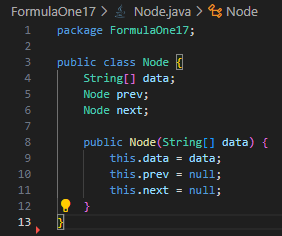 
2. Class DoubleLinkedList
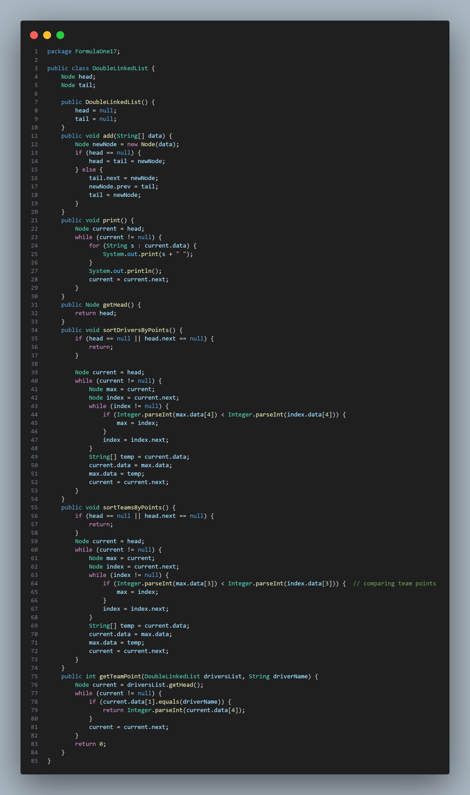 
3. Class Main 
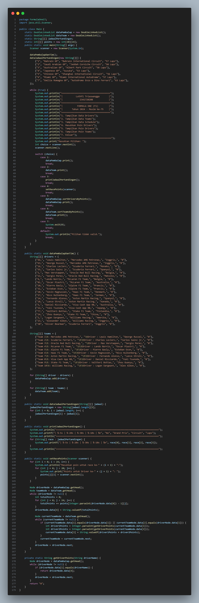 

## Output Kode Program

Menu Utama : 
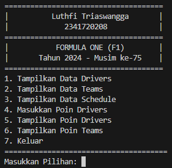 

Menu Tampilkan Data Drivers :  
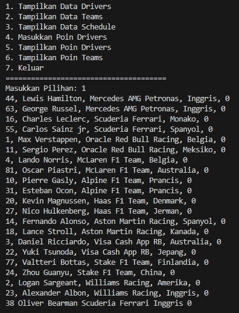 

Menu Tampilkan Data Team :  
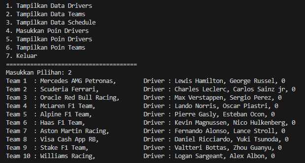 

Menu Tampilkan Data Schedule :  
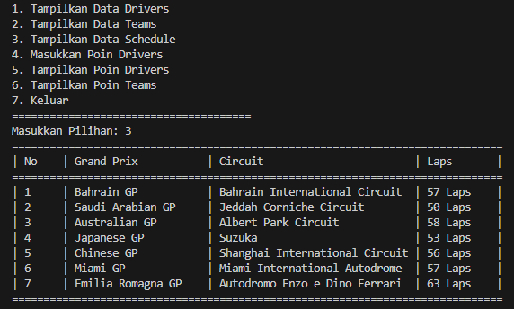 

Menu Masukkan Poin Drivers :  
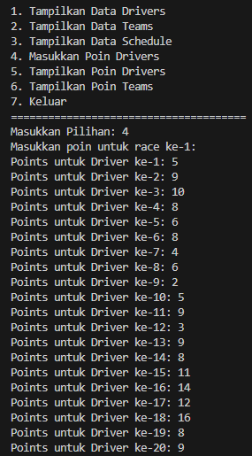 

Menu Tampilkan Poin Drivers :  
>
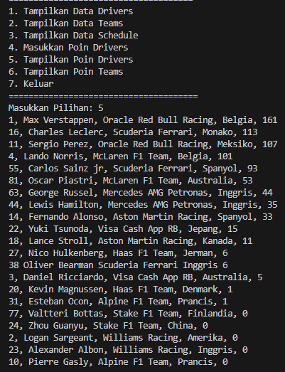 

Menu Tampilkan Poin Teams :  
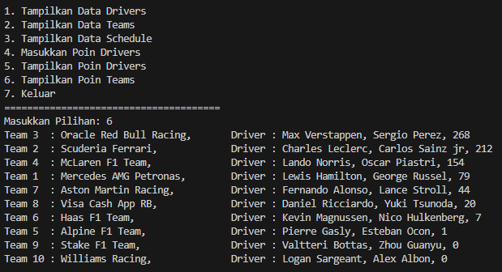 

Menu Keluar :  
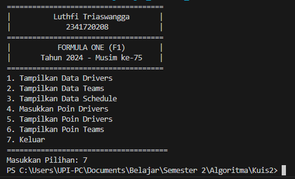